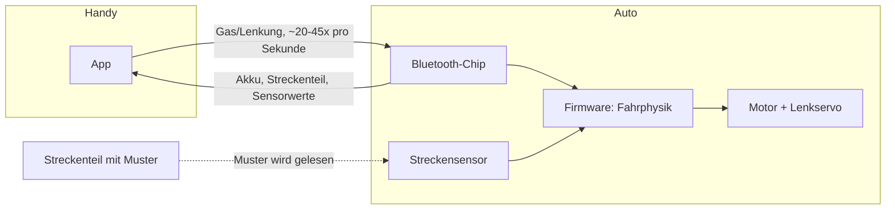

# Wie Carrera Hybrid Autos funktionieren

Dieses Dokument erklärt die Technik hinter den Carrera Hybrid Fahrzeugen. Es geht nicht um eine bestimmte App, sondern um das Fahrzeug und das System dahinter.

## Überblick

Carrera Hybrid ist eine Mischung aus klassischer Carrera-Rennbahn und freiem Ferngesteuert-Fahren. Bei einer klassischen Carrera-Bahn läuft das Auto in einer Rille auf der Schiene. Es kann die Spur nicht verlassen.

Bei Carrera Hybrid ist das anders. Die Fahrzeuge fahren frei, ohne Schiene und ohne Rille. Sie erkennen die Strecke trotzdem, weil die Streckenteile eine Markierung tragen. Ein Sensor im Auto liest diese Markierung. So weiß das Auto, wo es sich befindet und was für ein Streckenteil vor ihm liegt.

Gesteuert wird das Auto über eine Smartphone-App per Bluetooth. Es gibt auch einen optionalen Controller, in den man das Handy einklemmen kann. Der Controller hat richtige Knöpfe statt Touchscreen-Tasten.

## Der Aufbau des Autos

Ein Carrera Hybrid Auto enthält folgende Hauptteile:

- **Motor**: treibt die Hinterräder an.
- **Lenkservo**: dreht die Vorderräder nach links oder rechts.
- **Akku**: ein wiederaufladbarer Akku im Fahrzeug.
- **Bluetooth-Chip**: ein kleiner Funk-Chip, der die Verbindung zum Handy hält. Vermutlich ein Chip aus der Nordic-nRF52-Familie (dazu mehr weiter unten).
- **Sensor**: erkennt die Markierung auf den Streckenteilen. Ob es sich um eine kleine Kamera oder einen einfacheren Infrarot-Sensor handelt, ist nicht sicher bekannt.
- **Lichter**: mindestens Frontscheinwerfer. Ob es ein separates Bremslicht gibt, ist noch nicht bestätigt.

Die eigentliche Fahrphysik, also wie das Auto auf Gas und Lenkung reagiert, wird im Auto selbst berechnet. Die App schickt nur Zielwerte für Gas und Lenkung. Sie berechnet keine Fahrdynamik.

## Die Streckenteile

Jedes Streckenteil (Gerade, Kurve, Start-Ziel-Linie) hat ein eigenes Muster aufgedruckt. Dieses Muster ist für Menschen kaum sichtbar, aber für den Sensor im Auto lesbar.

So kann das Auto erkennen:

- welche Art von Teil gerade unter ihm liegt (Gerade, Rechtskurve, und so weiter)
- ob es sich noch auf der Strecke befindet oder bereits daneben fährt ("Off-Track")

Weil die Teile lose auf dem Boden oder Tisch liegen und keine feste Schiene bilden, kann jede Strecke frei zusammengebaut werden. Das Auto kann die Strecke auch komplett verlassen und irgendwo frei herumfahren.

### Zwei getrennte Codetabellen

Der Sensor arbeitet in zwei Betriebsarten, und **jede hat ihre eigene Codetabelle**. Das ist
der Punkt, an dem die Musterentzifferung monatelang falsch lief: dasselbe gedruckte Blatt hat
0x0a, 0x03 und 0x01 gemeldet, und daraus wurde geschlossen, der Unterschied liege im Druck —
Maßstab, Strichbreite, Schwärze, Papier. Er lag am Modus.

| Bahn-Modus (Byte 14, Bit 5) | Ausdruck-Modus (Byte 14, Bit 7) |
|---|---|
| `0x01` Start/Ziel | `0x0a` Start/Ziel |
| `0x02` Gerade | |
| `0x03` Linkskurve | |
| `0x04` Rechtskurve | |
| `0x05` / `0x06` Haarnadel | |
| `0x0a` **Engstelle** | |
| `0x00` abseits der Bahn | |

Die beiden Bits schließen sich aus. Wer Codes vergleicht, muss also den Modus mitnennen —
`0x0a` heißt auf Papier Start/Ziel, und auf der Schiene ist es eine **Engstelle**.

> **Im Ausdruck-Modus meldet je nach Vorlage auch `0x01` Start/Ziel.** Das Original-Blatt
> liefert `0x0a` (gemessen 25.08.), die App-eigenen Blätter (`startziel-a4.svg`, `muster-*`,
> `spur-*`) tragen das `0x01`-Wort — `isStartCode()` akzeptiert deshalb im Ausdruck-Modus
> beide Werte, auf der Schiene bleibt es strikt `0x01` (sonst zählte die Engstelle eine
> Phantomrunde).

> **Diese Tabelle stand bis v0.6.14 mit vertauschten Spalten hier.** Der Code-Kommentar in
> `src/60-track.js` sagte das Richtige: `0x0a` ist am *gedruckten Blatt* im Ausdruck-Modus
> gemessen (25.08.), über die Kunststoffschiene lag keine Messung vor. seVen hat auf
> Rückfrage bestätigt, dass seine Tabelle für den Bahn-Modus gilt — damit ist `0x01` der
> Schienencode, und beide Quellen stimmen überein. Die falsche Zuordnung in dieser Tabelle
> war folgenreich: `isStartCode()` akzeptierte beide Codes modus-blind, also hätte jede
> überfahrene Engstelle auf der Schiene eine Phantomrunde gezählt.

Offen ist damit nur noch, welche Balkenfolgen `0x02` (Gerade) und `0x04` (Rechtskurve)
tragen. Die Folge für `0x01` liegt vektorgenau vor, weil sie aus der Original-Druckvorlage
stammt (siehe unten).

### Wieviel Anlauf der Leser braucht — gemessen

Drei Messungen am gedruckten Start/Ziel-Blatt, alle am Auto gemacht:

1. **Die drei führenden dünnen Striche lassen sich abschneiden**, das Blatt wird weiter
   gelesen. Der Vorlauf ist damit **kein Nutzdatum**, sondern die Strecke, auf der sich der
   Leser auf die Modulbreite einstellt — und dafür genügt weniger als das Original bietet.
2. **Eines der beiden wiederholten Muster genügt.** Zusammen mit Punkt 1 ist die kleinste
   tragende Nutzlast ein einzelnes Wort ohne Vorlauf, etwa **54 mm** in Fahrtrichtung statt
   der 75,5 mm der Vorlage.
3. **Nach einem Erkennen bleibt der Leser etwa eine Sekunde stumm.** Bei 4 km/h
   Maßstabstempo sind das 1,1 m Fahrweg, also gut zweieinhalb Kachellängen. Ein Muster öfter
   als etwa jeden Meter zu wiederholen bringt deshalb nichts — und dieselbe Sperre ist der
   Grund, warum die Boxengassen-Erkennung per Doppel-Ausdruck einen Mindestabstand von einer
   Sekunde zwischen den beiden Kontakten fordert (`PIT_DOUBLE_MIN_MS`). Der Wert war
   ursprünglich geschätzt; er ist damit bestätigt.

Damit sind die fünf Vorlauf- und acht Probeblätter aus dem Repo verschwunden: das Experiment,
für das sie gebaut wurden, ist gelaufen. `tools/make_patterns.py` erzeugt sie in einem Aufruf
wieder, falls doch noch eine Probe gebraucht wird.

### Warum die Schienenmuster (noch) nicht entziffert sind

Am 31.08. wurden fünf Infrarot-Aufnahmen echter Streckenteile ausgemessen — Start/Ziel,
Gerade und Rechtskurve, aus einem Video. Der Versuch ist **gescheitert**, und zwar messbar:

| Prüfmaß | erwartet | gemessen |
|---|---|---|
| Restabstand des Fluchtpunkt-Fits der Balkenlinien | wenige px | **237 bis 579 px** |
| Verhältnis dicker zu dünner Balken | 1,83 | **1,09 bis 1,68** |

Der erste Wert sagt, dass die Balkenlinien sich nicht in *einem* Punkt treffen — sie sind
also nicht das Bild parallel liegender Weltlinien, und ohne diese Annahme lässt sich das Bild
nicht entzerren. Der zweite sagt, dass die beiden Breitenklassen im Rauschen verschwimmen:
JPEG-Kompression auf 20-Pixel-Merkmale, Weitwinkelverzerrung, ein Lichtfleck in der Bildmitte
und eine Hand im Bild.

Drei Verfahren wurden probiert und alle drei berichtet, weil das Scheitern jeweils eine
andere Ursache hat:

1. **Waagerechte Abtastlinie** — falsch, weil ein um θ gekippter Balken um 1/cos θ zu breit
   erscheint. Die Balken fächern von stark gekippt bis senkrecht, und daraus kamen
   Breitenverhältnisse bis 1:100. Das war Perspektive, nicht Information.
2. **Dicke senkrecht zum Balken**, über eine Hauptachsenzerlegung je zusammenhängendem
   Gebiet — richtig gemessen, aber die Ordnung stimmt nicht: eine globale Fahrtrichtung
   projiziert Balken aus verschiedenen Radien auf dieselbe Achse, und daraus wurden negative
   Lücken.
3. **Kleine Felder mit lokal gemessenem Winkel** — sauber, aber je Feld nur 6 bis 9 Balken.
   Aus so wenigen lässt sich keine Zweiklassen-Trennung belegen, und ein Median-Schnitt
   erzwingt eine Trennung auch dort, wo alle Balken gleich breit sind.

**Was die Bilder trotzdem belegen**, und beides geht in die Druckvorlagen ein:

- Die Balken bedecken die **ganze** Kachel, 40 und mehr je sichtbarem Abschnitt. Das Wort
  wiederholt sich also fortlaufend, damit das Auto es liest, wo immer es auffährt.
- In Kurven laufen die Balken **radial**. Sie treffen sich im Kurvenmittelpunkt, nicht in
  einem perspektivischen Fluchtpunkt — genau deshalb schlug der Fluchtpunkt-Fit dort fehl.

**Was es bräuchte:** einen **Flachbett-Scan** eines echten Streckenteils, 300 dpi, flach
aufgelegt. Dort gibt es keine Perspektive, keinen Lichtfleck und keine Videokompression, und
die Balkenbreiten sind direkt in Millimetern messbar. Ein einziger Scan einer Geraden und
einer Kurve würde beide Wörter liefern.

### Die Maße des Start/Ziel-Musters

Aus `target_finish.pdf` ausgelesen, nicht nachgemessen (`tools/make_pattern.py`):

```
dünner Balken   3,598 mm      dicker Balken   6,604 mm
dünne Lücke     3,514 mm      dicke Lücke     6,530 mm
Balkenbreite quer 275,9 mm    Musterlänge in Fahrtrichtung 75,5 mm
9 Balken, 8 Lücken:  Balken 000010010   Lücken 00010110   (1 = dick, in Leserichtung)
```

Balken **und** Lücken tragen Information, das Verhältnis dick/dünn ist 1,83 — die Bauform
eines Strichcodes mit schmalen und breiten Elementen, 17 Elemente je Wort. Die Balkenbreite
von 275,9 mm ist volle A4-Querbreite, bei 250 mm Bahnbreite.

## Streckenscan

Bevor ein Rennen beginnt, kann die App die Strecke einmal abscannen. Dabei fährt das Auto (gesteuert von der App oder von Hand) einmal die ganze Strecke ab. Jedes Mal, wenn ein neues Streckenteil erkannt wird, meldet das Auto das per Bluetooth an die App.

So entsteht Stück für Stück eine digitale Karte der Strecke. Diese Karte kann die App später nutzen, zum Beispiel für eine Renn-Übersicht oder für computergesteuerte Gegner.

## Die Bluetooth-Verbindung

Handy und Auto sprechen über **Bluetooth Low Energy** (kurz BLE) miteinander. Das ist der stromsparende Bluetooth-Standard, den auch smarte Kopfhörer oder Fitness-Tracker nutzen.

Die Verbindung läuft über einen Kanal, der als **Nordic UART Service** bekannt ist. Das ist eine Art virtuelle serielle Leitung über Bluetooth. Viele kleine Elektronikgeräte nutzen diesen Standardkanal, weil er einfach einzubauen ist.

Wichtig ist: Die App schickt nicht nur einmal ein Kommando, wenn man Gas gibt. Sie schickt stattdessen etwa 20 bis 45 Mal pro Sekunde ein Datenpaket mit dem aktuellen Gas- und Lenkwert. Das Auto erwartet diesen ständigen Strom an Befehlen. Bleibt der Strom aus, geht das Auto vermutlich in einen sicheren Stillstand über.

In die andere Richtung, vom Auto zum Handy, schickt das Auto ebenfalls ständig Statuspakete. Darin stecken unter anderem:

- der Akkustand
- welches Streckenteil gerade erkannt wurde
- ob das Auto von der Strecke abgekommen ist
- Rohdaten von Bewegungssensoren (vermutlich Beschleunigung oder Drehrate)



## Wer steuert die Fahrphysik?

Ein wichtiger Punkt, den man leicht falsch einschätzt: Die App ist kein Physik-Simulator. Sie schickt dem Auto nur, was der Fahrer will (wie viel Gas, welche Lenkrichtung). Das Auto selbst entscheidet, wie es darauf reagiert.

Das erklärt auch, warum der Gaswert kein einfacher "Stopp bis Vollgas"-Wert ist. Er wirkt eher wie ein Wert, der sich weich hoch- und runterregelt, ähnlich wie beim Gasgeben in einem echten Auto. Die Feinarbeit passiert in der Firmware des Autos, nicht in der App.

### Was OmegaSim daneben rechnet

Die Aussage oben gilt fuer das Auto: die Fahrdynamik entsteht in seiner Firmware. OmegaSim
rechnet daneben ein eigenes Modell, und zwar nicht als Ersatz, sondern um die **zwei Bytes zu
formen**, die ohnehin gesendet werden. Der Unterschied ist wichtig: alles, was das Modell tut,
muss am Ende ein Gaswert und ein Lenkwert sein, sonst kommt es am Auto nicht an.

**Gewichtsverlagerung, vier Raeder.** Aus Gas, Bremse und Lenkung folgt eine Lastverteilung
auf vier Raeder:

- **Bremsen verlagert nach vorn**, Gas nach hinten. Der Achsanteil laeuft von 0,2 bei Vollgas
  ueber 0,5 im Rollen bis 0,8 unter Vollbremsung.
- **Lenken verlagert nach aussen.** Eine Rechtskurve belastet die linken Raeder.
- Beides multipliziert ergibt die Radlast, **im Mittel immer genau 1,0**. Gemessen fuer eine
  Rechtskurve unter Vollbremsung: vorne links 2,72, vorne rechts 0,48, hinten links 0,68,
  hinten rechts 0,12. Die Linkskurve ist die exakte Spiegelung.

Die Verlagerung **verschiebt** Last, sie erfindet keine: der Verschleissmittelwert ist mit und
ohne Asymmetrie exakt gleich. Aus den vier Radlasten folgen vier Reifentemperaturen, vier
Verschleisswerte und vier Bremsscheibentemperaturen, und die stehen so im Cockpit.

**Was davon wirkt und was nur anzeigt.** Das Auto rutscht in echt nicht, also kann das Modell
nur ueber die zwei Bytes wirken:

| Groesse | Art | Wirkung |
|---|---|---|
| Reibkreis (Bremsen nimmt Lenkung) | Aktor | schneidet den Lenkwert |
| Bremsfading | Aktor | verlaengert den Bremsweg ueber das Bremsbyte |
| Reifengriff kalt/heiss/abgefahren | Aktor | senkt Lenk- und Bremswert |
| Reifenzug bei ungleichem Verschleiss | Aktor | kleiner Lenk-Offset |
| Radlasten, Temperaturen, Scheiben | Instrument | Anzeige im Cockpit |

**Der Reibkreis** ist der Teil, den man am deutlichsten spuert: was die Bremse an der
Vorderachse verbraucht, fehlt der Lenkung. Er hat einen Boden von 0,12, damit das Auto nie
voellig hilflos ist - im Regen wird dieser Boden weggeskaliert, weil dort wirklich nichts mehr
uebrig ist.

### Wann das Auto selbst faehrt

Zwei Lagen, in denen die Eingabe des Fahrers **ersetzt** und nicht nur geformt wird - der
einzige Aktor in der Tabelle oben, der das tut:

| Lage | Ziel | Lenkung |
|---|---|---|
| Gelbe Flagge | 80 km/h, mittig | null, damit die Spur vorhersagbar bleibt |
| Einfuehrungsrunde (fliegender Start) | Boxentempo | Schlaengeln plus die Seite des Startplatzes |
| … dabei neben der Bahn | unveraendert | **beim Fahrer** – siehe unten |

Beides laeuft ueber `autopilotGrund()` in `src/50-drive.js`, das den GRUND zurueckgibt und
nicht nur ein Ja: die Flaggenanzeige braucht ihn auch, und sie hatte die Bedingung bis
v0.4.54 ein zweites Mal abgeschrieben.

**Warum ueber die Eingaben und nicht mit einem Ghost-Gehirn.** `sendControlValue()` schreibt
ausschliesslich an `playerCar`, die Ghosts senden ueber ihren eigenen Pfad in `ghostTick()`.
Ein `startGhost()` auf das Auto des Fahrers haette zwei Sender auf derselben Charakteristik
ergeben, die sich um den 45-ms-Takt streiten. Also bekommt `physicsStep()` synthetische
Eingaben, und es bleibt bei einem Sender, einer Physik und einer Anzeige.

**Nur in der Bahn-Stellung, und das ist keine Vorsicht, sondern eine Tatsache.** Im
Ausdruck-Modus haelt sich das Auto nicht selbst auf der Bahn; ein Autopilot ohne
Querregelung wuerde es geradeaus in die Bande fahren. Deshalb steigt `autopilotGrund()` bei
`trackMode !== 'on'` aus, in beiden Lagen.

**Und nur, solange das Auto die Bahn wirklich liest.** Dasselbe Argument gilt naemlich auch
voruebergehend: liegt das Auto neben der Bahn, meldet Byte 12 keinen Code mehr, die
modeBytes gehen nicht hinaus, und das Auto liest den Lenkwert wieder als Radstellung statt
als Querlage. Ein Autopilot, der dann weiter „geradeaus" vorgibt, stellt die Raeder gerade –
und der Fahrer kann nicht zurueckfahren. Seit v0.6.28 gibt der Autopilot in diesem Fall die
LENKUNG her und behaelt Gas und Bremse: eine gelbe Flagge bleibt eine gelbe Flagge, aber
lenken darf, wer es kann. Dieselbe Bedingung schaltet die drei Fahrhilfe-Modi zurueck.

Gemessen wird das ueber `abseitsJetzt()` in `src/50-drive.js`, also entprellt: Byte 12
flattert, und ein einzelnes 0x00 zwischen guten Lesungen ist Rauschen. Die Uebergabe braucht
deshalb `offtrackEinMs`, ab Werk eine Sekunde.

**Die Bremse des Fahrers gewinnt - in der Einfuehrungsrunde.** Dort rollt das Feld in zwei
Kolonnen dicht hintereinander, und ein Auto, das man nicht anhalten kann, ist ein Auto, das
rammt. Bei Gelb bleibt es absichtlich beim vollen Eingriff: dort ist der Sinn, dass die
Haende ganz frei sind, waehrend man abgeflogene Autos aufsammelt.

Bis v0.4.54 kannte diese Stelle nur die gelbe Flagge. Der fliegende Start war damit halb
umgesetzt: die Ghosts rollten von selbst im Boxentempo, das Auto des Fahrers wurde nur
GEDROSSELT (`limitFormation` -> `speedLimitFactor`) und musste weiter von Hand gelenkt und
gegast werden. `raceFormationLap` kam in `50-drive.js` an keiner Stelle vor.

### Der Steuerweg: wo die Eingabeverzögerung wirklich sitzt

Gemeldet als „mit zwei Ghosts gibt es eine leichte Eingabeverzögerung, lässt sich die
Berechnung beschleunigen?“ — gemessen ist die Antwort **nein, die Rechnung ist es nicht**.
`OMEGA_TEST.taktKosten()` misst den ganzen Takt an den echten Funktionen des Herzschlags
(`physicsStep`, `pitLaneTick`, `sendControlValue` samt Motorton, dazu `ghostTick` je Ghost):

| | Median | 95. Perzentil |
|---|---|---|
| ohne Ghosts | 0,3 ms | 0,5 ms |
| mit zwei Ghosts | 0,4 ms | 0,9 ms |

Das sind **unter zwei Prozent** des 45-ms-Budgets. Ein Ghost kostet 0,05 ms, ein
hereinkommendes Meldepaket 0,002 ms. Es gibt in dieser Rechnung nichts zu holen; wer sie
optimiert, gewinnt Mikrosekunden und verliert Lesbarkeit.

**Die Verzögerung sass im Schreibweg.** Bis v0.5.8 stand in `sendControlValue()` an zwei
Stellen `if (writeInFlight) return;` — läuft noch ein Schreibvorgang, fällt dieser Takt
ersatzlos aus. Gemessen mit einem Ziel, dessen Schreibvorgang eine einstellbare Zeit braucht
(`OMEGA_TEST.sendeUnterLast()`):

| Schreibdauer | vorher | seit v0.5.8 | Obergrenze |
|---|---|---|---|
| 5 ms | 22,4 Hz | 22,3 Hz | 22,2 Hz |
| 30 ms | 22,4 Hz | 22,3 Hz | 22,2 Hz |
| **46 ms** | **11,2 Hz** | **22,0 Hz** | 21,7 Hz |
| 60 ms | 11,2 Hz | 17,0 Hz | 16,7 Hz |
| 100 ms | 7,6 Hz | 10,3 Hz | 10,0 Hz |

**Eine Millisekunde über dem Takt halbierte die Befehlsrate.** Keine sanfte
Verschlechterung, sondern eine Stufe — und genau so fällt sie an, sobald ein zweites und
drittes Auto denselben Funkadapter benutzen. Statt zu verwerfen wird das neueste Paket jetzt
gemerkt und abgesetzt, sobald der Funk frei ist; die Tiefe ist **eins**, ein zweites
wartendes Paket überschreibt das erste. Eine Warteschlange würde alte Daumenstellungen
nachliefern, und ein verspäteter Lenkbefehl ist schlimmer als gar keiner. Die Senderate
bleibt dabei von selbst begrenzt: es geht nie ein zweiter Schreibvorgang los, bevor der
erste fertig ist. Alle fünf Zeilen liegen jetzt an ihrer physikalischen Obergrenze.

**Wie lange ein Schreibvorgang auf dieser Hardware wirklich dauert, ist nicht gemessen** —
dafür bräuchte es die Autos. Die Tabelle sagt nur, was die App tut, wenn er lange dauert.

Zwei Nebenbefunde aus derselben Durchsicht, beide behoben:

* Der Versatz der Ghost-Sendezeitpunkte wurde vom **Klick** aus gemessen, obwohl der
  Kommentar „Stagger against the player's heartbeat“ versprach. Über vier Sekunden mit zwei
  Ghosts lag einer im Mittel **0,7 ms** vom Sendezeitpunkt des Spielers entfernt (58 von 88
  Paketen unter 5 ms), der andere bei 15,1 ms — Soll sind 45/3 = 15 ms. Welcher es trifft,
  hing am Zufall des Klickzeitpunkts. Ob gleichzeitiges Senden auf dem Funk etwas kostet,
  ist **nicht** gemessen; behoben wurde es, weil der Kommentar eine Zusicherung gab, die der
  Code nicht einhielt.
* Der wartende `setTimeout`, der den Ghost-Zeitgeber anlegt, hatte **keinen Griff**.
  `stopGhost()` löschte `car.timer`, der in diesem Fenster noch `null` ist. Ein Durchlauf
  der Selbsttests hinterliess dadurch **35 Phantom-Zeitgeber**, die bis zum Neuladen
  weitertickten und weiter an ihr Auto schrieben. Jetzt sind es null.

### Fahrzeuglayout: fuenf Bauformen

Bis v0.5 hatten alle Autos DASSELBE Fahrwerk. Unterschiedlich war nur der Klang; die statische
Achslastverteilung stand als Literal `0.5` in der Verlagerungszeile und kam sonst nirgends vor.
Seit v0.5 gibt es fuenf Layouts: Neutral (Vorgabe, reproduziert das bisherige Verhalten genau),
die drei GT3-Motorlagen und ein Formel-1-Monoposto.

| Layout | Achslast v:h | Radstand | I_z | K_u |
|---|---|---|---|---|
| Neutral, kalibriert | 50 : 50 | 2,60 m | 2000 | 0 (neutral) |
| GT3, Frontmotor (BMW M4 GT3) | 50 : 50 | 2,85 m | 2500 | 0 |
| GT3, Mittelmotor (Ferrari 296 GT3) | 44 : 56 | 2,60 m | 1800 | -0,0003 |
| GT3, Heckmotor (Porsche 911 GT3 R) | 39 : 61 | 2,50 m | 2200 | -0,0006 |
| Formel-1-Monoposto | 45 : 55 | 3,60 m | 1000 | -0,0003 |

**Dass die drei Motorlagen GT3-Varianten sind, ist wichtiger als es klingt:** sie unterscheiden
sich NUR in Achslast, Radstand und Traegheitsmoment, waehrend Leistung, Reifen und Bremse
dieselben bleiben. Deshalb zeigt der Wechsel, was die *Motorlage* macht, und nicht, was eine
andere Klasse macht.

Die Zahlen sind Schaetzungen aus der Fahrzeugklasse und keine Messungen. Am unsichersten ist
das Traegheitsmoment des F1-Autos.

**Was spuerbar ist**, gemessen als uebertragener Winkel bei 140 km/h unter Vollbremsung, mit der
Lenkkalibrierung 200 Prozent:

| Layout | rollend | bremsend | Lenkrate |
|---|---|---|---|
| Neutral / GT3 Front | 45 Grad | 26 Grad | 6,0 / 4,8 |
| GT3 Mitte | 45 Grad | 20 Grad | 6,7 |
| Formel 1 | 45 Grad | 21 Grad | 9,0 |
| GT3 Heck | 45 Grad | 13 Grad | 5,5 |

**Warum die Kalibrierung dabei nicht kippt.** `loadFrontOnPower` und `loadFrontOnBrake` waren
eigene Konstanten (0,20 und 0,80) und damit `0,5 -/+ transferK` - dieselbe Geometrie an einem
zweiten Ort. Der Vortrieb ist auf `loadFrontOnPower` normiert, ausdruecklich damit die gemessene
Anfahrzeit bleibt, wie kalibriert. Seit v0.5 werden die beiden **gerechnet**: damit gilt am
Vollgas-Gleichgewicht weiterhin `rearGrip = 1`, egal welches Layout, und die
Beschleunigungskalibrierung bleibt unberuehrt. Das Layout aendert die **Balance**, nicht die
Geradeausleistung.

Die absolute Achslast wirkt **nur vorne**, und das ist eine bewusste Unsymmetrie: die
Vorderachskapazitaet geht ausschliesslich in die Lenkung. Denselben Griff hinten absolut zu
rechnen wuerde die Anfahrzeit veraendern - und die ist gegen eine Messung kalibriert. Eine
gewaehlte Bauform darf eine Messung nicht verschieben.

Und die Staerke ist **gemessen und keine Reifeneigenschaft**. Zuerst stand dort die
Lastempfindlichkeit eines Rennreifens als Exponent 0,85 - physikalisch begruendet und
unbrauchbar: der Reibkreis ist eine Wurzel aus einer Differenz von Quadraten und saettigt
schon bei zehn Prozent Absenkung. Drei von fuenf Layouts klebten am Notboden von 0,12, also bei
5 Grad Einschlag. Linear mit Staerke 0,15 ergibt die geordnete Spreizung oben.

### Getriebearten: drei Uebersetzungssaetze

Bis v0.4.53 hatte jedes Auto dasselbe Getriebe: sechs Gaenge, `GT3_GEARS`. Seit v0.4.54 gibt
es drei, und sie sind **senkrecht zu den Voreinstellungen** - dieselbe Trennung wie beim
Layout, mit demselben `data-preset-skip`. Ein Klick auf die Voreinstellung "F1" ist eine
Abstimmung; das Getriebe "Formel 1" ist ein Auto.

| Getriebe | Gaenge | Schaltzeit | Rueckschaltschwelle |
|---|---|---|---|
| GT3, sequenziell *(Vorgabe)* | 6 | 120 ms | 4200/min |
| Formel 1 | 8 | 40 ms | 5600/min |
| Ferrari 412P, Transaxle | 5 | 350 ms | 3400/min |

**Die Uebersetzungen sind gerechnet, nicht getippt.** In der GT3-Tabelle, die gegen eine echte
Beschleunigungstabelle gefittet wurde, ist das Produkt `ratio x topFrac` fuer die Gaenge 1 bis
5 konstant 0,9507 und faellt beim sechsten auf 0,88 - der ist luftwiderstandsbegrenzt und
erreicht den Begrenzer nicht. Diese Unsymmetrie ist echt und wird uebernommen:

    ratio_i = 0,9507 / topFrac_i    fuer alle ausser dem letzten Gang
    ratio_n = 0,88                  bei topFrac_n = 1,0

Weil der letzte Gang in jedem Getriebe `0,88 / 1,0` traegt, bleibt `ratioRef` - der Bezug, auf
den `thrustAt()` normiert - ueberall 0,88, und der Anker der Beschleunigungskalibrierung ist
unberuehrt. Gewaehlt ist nur die **Spreizung**, und dort sitzt der Charakter: acht enge Gaenge
oben (84 / 92 / 100 Prozent der Spitze) gegen fuenf weite (30 / 45 / 62 / 81 / 100).

**Was das Getriebe aendert, ist die Form und nicht die Schlagzeilenzahl.** `calibrateAccel()`
laeuft nach jedem Wechsel neu und loest gegen die eingestellte Zeit von null auf
Hoechstgeschwindigkeit. Was sich also verschiebt, ist wo die Stufen sitzen und welcher Gang
zieht - genau wie das Layout die Balance aendert und nicht die Geradeausleistung.

**Die Drehzahlgrenze bleibt bei 9000.** Sie ist eine Eigenschaft des Motors und nicht des
Getriebes; ein Getriebe, das die Drehzahlgrenze mitbringt, waere ein Motor mit Zahnraedern.

Drei Fallen stecken in der Umsetzung, und alle drei sind Voraussetzungen, die vorher galten:

* **Das Uebersetzungs-Array wird an der Stelle geaendert, nicht ersetzt.** Die Ghosts teilen
  es per Verweis, damit `accelScale()` nicht zweimal kalibriert. Ein Splice erreicht damit
  jeden Teilhaber auf einmal, auch einen schon fahrenden Ghost; ein neues Array haette den
  Verweis gekappt, und das Feld waere still im alten Getriebe weitergefahren.
* **Die Tabelle darf nicht das eigene Array sein.** `config.gears` zeigte bis v0.4.53 direkt
  auf `GT3_GEARS`. Ein Splice darauf haette die Tabelle zerstoert, aus der er die Werte nimmt -
  zurueck auf GT3 haette dann acht Gaenge gehabt. Seit v0.4.54 ist es eine Kopie.
* **Der Kalibrierbezug braucht eine eigene Kopie.** `calibRef` ist eine flache Kopie der
  Konfiguration, und sein Kommentar behauptete ausdruecklich, `gears` werde nie geaendert.
  Ohne eigene Kopie waere der Bezug mitgewandert: die Messaufbauten stellen mit
  `Object.assign(cfg, calibRef)` den gefitteten Zustand her, und dort snappen `ratioRef`,
  `rpmScale`, `upshiftRpm` und `shiftMs` als Skalare zurueck - die Uebersetzungen aber nicht.
  Das Ergebnis waeren GT3-Schaltpunkte auf F1-Zahnraedern, also eine Messung, die still falsch
  ist statt offen anders.

Und eine Zusicherung, die kein Getriebe verletzen darf: **die Automatik darf nicht pendeln.**
Nach einem Hochschalten faellt die Drehzahl auf `upshiftRpm x ratio[i+1] / ratio[i]`; liegt die
Rueckschaltschwelle darueber, schaltet sie hoch und sofort wieder herunter. Gemessene Reserve
ueber den engsten Gangsprung: GT3 1385, Formel 1 915 (enge Gaenge, also knapper), 412P 2324
Umdrehungen. Ein Selbsttest rechnet das nach, statt es zu glauben.

### Das Einspurmodell

Gebaut in v0.5, als **Instrument**: es rechnet Gierrate, Schwimmwinkel, Achsschraeglaufwinkel
und Eigenlenkgradient, und nichts davon stellt die Lenkung. Das Modellauto rutscht nicht.

Der Schritt ist **halbimplizit**, nicht explizit - bei 45 ms Sendetakt und hoher
Schraeglaufsteifigkeit wird explizites Euler instabil. Nachgewiesen: der Sprungversuch schwingt
ein und nicht auf, auch mit vierfach ueberhoehter Steifigkeit.

Die drei Proben laufen als Selbsttests. Der Kleinwinkel-Grenzfall trifft die reine Geometrie
`L/R` auf 0,01 bis 1,07 Prozent; der Eigenlenkgradient faellt aus einer stationaeren Kreisfahrt
mit konstantem Radius auf 1 bis 2 * 10^-4 heraus.

**Eine Probe war zuerst falsch, und zwar die Probe und nicht das Modell.** Die Formel
`K_u = (d2-d1)/(ay2-ay1)` verlangt einen KONSTANTEN Radius bei verschiedenem Tempo. Der erste
Aufbau hielt das Tempo fest und veraenderte den Lenkwinkel; damit blieb der geometrische Anteil
`L/R` im Unterschied stehen, und die Probe meldete 0,021 statt 0. Aufgefallen ist es daran, dass
der uebertragene Winkel und `L*r/v` auf 6 * 10^-5 zusammenfielen.

**Und eine Stelle, an der das Modell sonst stumm geblieben waere:** waere die
Schraeglaufsteifigkeit strikt proportional zur Achslast, kuerzte sich der Eigenlenkgradient
exakt weg - `K_u = m*f/(C*f) - m*(1-f)/(C*(1-f)) = 0` fuer JEDE Verteilung. Das Modell haette
jedes Layout als neutral gemeldet. Ein Reifen traegt Seitenkraft unterlinear zur Last; erst
dieser Exponent macht aus einer Achslastverteilung ein Eigenlenkverhalten.

**Was das Modell NICHT als Zahl sagen kann.** Der Betrag der Querbeschleunigung ist keine
brauchbare Anzeige - gemessen 212 m/s^2 (21 g) bei 120 km/h und 28,8 Grad Einschlag. Die
Rechnung ist richtig: 28,8 Grad bei 120 km/h IST ein Radius von fuenf Metern. Der Widerspruch
steckt in den Eingaengen - der Lenkbereich bis 45 Grad gehoert zu einem Modellauto, die
angezeigten km/h zu einem echten. Schon vier Grad sind bei 120 km/h 3,1 g; bei 25 km/h und
fuenf Grad dagegen 0,17 g. Im langsamen Bereich einer Wohnzimmerstrecke stimmen die Zahlen.

Das Cockpit zeigt deshalb die **Ausnutzung** und nicht den Betrag, mit einem Groesserzeichen
ueber 100 Prozent. Und der G-Plot zeigt die gerechnete Querbeschleunigung, normiert auf die
Haftgrenze statt auf 1 g - sonst klebte der Punkt schon bei maessiger Kurvenfahrt am Rand.

### Reifenquietschen am Grenzbereich

Getrieben von der Querausnutzung des Reibkreises, Einsatz ab 85 Prozent, Lautstaerke UND
Tonhoehe laufen stetig mit. Absichtlich spaet: ein Quietschen, das bei jeder Kurve mitlaeuft,
ist ein Dauergeraeusch und keine Rueckmeldung.

Getrieben wird es von `latUse` und nicht von der Modell-Ausnutzung: `latUse` ist auf 1 begrenzt
und beziffert "am Limit" wirklich mit 1, waehrend die Modell-Ausnutzung aus dem oben genannten
Grund oft darueber steht.

Der Ton ist vollstaendig synthetisch und eine Groessenordnung tiefer als das Bremsenquietschen
(Frequenzschwerpunkt 1473 gegen 3382 Hz). Einzelheiten in `audio/CREDITS.md`.

### Die Lenkgrenze: 45 Grad, und kein Regler kommt darueber

Byte 7 traegt den Lenkwert als `round(winkel * 127)` in einem **vorzeichenbehafteten** Byte.
127 ist das Maximum dieses Bereichs, und die App sendet es bei Vollanforderung. Daraus folgt:

- Kein Reglerwert kann das Auto weiter einschlagen lassen als seine Mechanik. Die 45 Grad sind
  eine Grenze des Fahrzeugs, nicht der Software.
- Ein Wert **ueber** 1,0 waere schaedlich und nicht nur wirkungslos: beim Umbruch des
  vorzeichenbehafteten Bytes kaeme er als Einschlag in die ANDERE Richtung an. Der Deckel bei
  1,0 ist deshalb keine Vorsicht, sondern notwendig.

Was eine Kalibrierung dennoch bringt: der uebertragene Winkel wird **vor** dem Senden mit dem
Reibkreis multipliziert. Beim Anbremsen einer engen Kurve - dem Moment mit dem groessten
Einschlagbedarf - bleiben davon etwa 60 bis 77 Prozent. Eine Kalibrierung hinter dieser
Multiplikation holt das zurueck. Gemessen bei 60 km/h unter Vollbremsung:

| Kalibrierung | 100 % | 150 % | 200 % | 250 % | 300 % |
|---|---|---|---|---|---|
| erreichter Winkel | 35 Grad | 45 Grad | 45 Grad | 45 Grad | 45 Grad |
| Anschlag ab Stickanteil | nie | 40 % | 30 % | 25 % | 20 % |

Bei 100 Prozent werden die 45 Grad also **nie** erreicht. Oberhalb von 150 Prozent ist bei
vollem Ausschlag nichts mehr zu holen; der Unterschied liegt nur darin, wo im Stickweg der
Anschlag anliegt - und der Preis ist Feingefuehl, weil der letzte Teil des Sticks dann nichts
mehr sagt.

**Die zwei Regler arbeiten gegeneinander**, und das ist keine Nachlaessigkeit, sondern folgt
aus der Rechnung: eine Kalibrierung von 200 Prozent macht jede Beschneidung oberhalb von 0,5
unsichtbar. Wer den Reibkreis spueren will, muss die Kalibrierung senken oder den Reibkreis so
weit aufdrehen, dass die Kalibrierung ihn nicht mehr ausgleichen kann.

### Controller: eine Taste, eine Bedeutung

Die Belegung steht zuweisbar in den Optionen unter Controller. Ab Werk, mit
PlayStation-Namen zuerst:

| Taste | Aktion |
|---|---|
| R2 / RT | Gas |
| L2 / LT | Bremse |
| Linker Stick, X-Achse | Lenkung |
| Quadrat / X | Runterschalten |
| Kreis / B | Hochschalten |
| Dreieck / Y | Licht an/aus |
| R3 (rechten Stick druecken) | Lichthupe |
| L1 / LB | Leseart: Bahn oder Ausdruck |
| R1 / RB | Getriebe: Automatik oder von Hand |
| Kreuz / A, 1 s halten | Gelbe Flagge |
| Options / Start | Boxenstopp |
| Select / Share | Rennen starten oder abbrechen |
| L3 (linken Stick druecken) | nichts |
| Steuerkreuz hoch / runter | Lenkansprechen groesser / kleiner |
| Steuerkreuz links / rechts | Cockpit-Schirm vor / zurueck |

**Das Steuerkreuz stand bis v0.5.17 gar nicht in dieser Tabelle**, obwohl es belegt war — es
ist fest verdrahtet und nicht zuweisbar, und deshalb ist es durch die Belegungsliste
gerutscht. Bis dahin lag hoch/runter auf der Bremsbalance und links/rechts auf dem
Lenkansprechen; seit v0.5.18 blaettert links/rechts die Cockpit-Schirme, und die Bremsbalance
hat den Regler in den Optionen und die Zieh-Skala im Cockpit.

Drei Punkte dazu, alle drei aus Fehlern gelernt:

- **Die Beschriftungen nennen den PlayStation-Namen zuerst.** "X / Quadrat" war mehrdeutig:
  auf einer Xbox ist Knopf 2 das X, auf einer PlayStation das Quadrat - und "X" bedeutet auf
  einer PlayStation den Knopf 0. Eine Beschriftung, die zwei Tasten bedeuten kann, ist der
  Fehler und nicht der Leser.
- **Jede Taste traegt genau eine Bedeutung** — mit einer Einschraenkung, die seit v0.5.18
  gilt und ausgesprochen gehoert. Der linke Stick loest ausdruecklich nichts aus, weil man ihn
  beim Lenken drueckt. Beim Laden wird auf Kollisionen geprueft: liegen zwei Aktionen auf
  demselben Eingang, geht die zweite auf ihre Vorgabe zurueck, und es wird gemeldet statt
  still behoben.

  **Die Einschraenkung sind KONTEXTVERBRAUCHER, und es gibt genau drei.** Streckeneditor,
  Boxenschirm und ein Rennstart nehmen einzelne Tasten vorruebergehend an sich; danach gilt
  wieder die Tabelle. Das ist etwas anderes als eine Doppelbelegung: die Bedeutung wechselt
  nicht heimlich mit einem Zustand, den man nicht sieht, sondern mit einem Schirm, den man
  gerade ansieht.

  Auf dem Boxenschirm waehlt die Flaggentaste dort aus statt die gelbe Flagge zu laden — und
  zwar GANZ, ohne Unterscheidung nach Haltedauer. Genau die war bis v0.5.1 gebaut (Quadrat
  trug Runterschalten *und* die Flagge) und ist als Fehler zurueckgenommen worden: zwei
  Bedeutungen, die sich nur in Millisekunden unterscheiden, sind fuer die Hand nicht zwei
  Bedeutungen. Wer auf dem Boxenschirm Gelb geben will, blaettert zurueck.

### Als App installieren

OmegaSim laesst sich als App ins Startmenue legen: Chrome zeigt dafuer ein Symbol in der
Adresszeile, und auf dem Startschirm der App steht ein Knopf, sobald der Browser es anbietet.
Der Browser-Betrieb bleibt davon unberuehrt - wer nichts installiert, merkt nichts.

**Was es bringt:**

- Vollbild ohne Adresszeile, ein eigenes Symbol, ein eigener Fenstereintrag.
- **Start ohne Netz.** Ein Service Worker legt die Huelle ab (die eine HTML-Datei, das
  Manifest, die Symbole). Die Tonschleifen von 1,8 MB werden absichtlich NICHT vorab geladen -
  wer die App nur zum Streckenbauen aufmacht, soll nicht Motorgeraeusche herunterladen; sie
  landen beim ersten Hoeren im Cache und sind ab dann auch ohne Netz da.
- Web Bluetooth funktioniert unveraendert: die installierte App behaelt die Herkunft der Seite.

**Was es NICHT bringt, und das ist der Punkt, der falsch erwartet wird:** es loest das
Mehrspieler-Problem nicht. Der secure context haengt an der HERKUNFT, und die ist nach dem
Installieren dieselbe wie vorher. Wer die App von `http://192.168.x.x` installiert, hat
danach genau dieselbe Sperre wie im Browser.

**Der Cache wird NETZ-ZUERST gefuellt**, nicht Cache-zuerst. Der uebliche Rat lautet
umgekehrt, weil es schneller aussieht - fuer dieses Projekt waere es die schlechteste Wahl:
es wird mehrmals am Tag neu gebaut, und ein Cache-zuerst-Arbeiter liefert dann eine alte
Fassung aus, waehrend die neue schon daliegt. Der Fehlerbericht heisst dann "die Behebung ist
nicht drin", und man sucht im Code statt im Cache. Online also immer aktuell, offline die
letzte gesehene Fassung.

Der Cachename traegt die Programmversion, und `tools/build.py` setzt sie aus derselben Quelle
ein, aus der auch die Anzeige kommt (das span mit der id `app-version`). Bleibt der Name
gleich, ueberlebt der Arbeiter jeden Build - deshalb bricht der Build ab, wenn die Marke in
`tools/sw.js.in` fehlt.

Auf **iOS** erscheint kein Installationsknopf. Das ist richtig so: Safari hat kein Web
Bluetooth, die App kann dort kein Auto fahren. Streckenbau und Doku funktionieren, und dafuer
liegen die Apple-Kopfzeilen und das Touch-Symbol bei.

## Mehrspieler-Rennen

Laut Hersteller können mehrere Spieler gleichzeitig fahren. Jedes Handy verbindet sich dabei über Bluetooth mit seinem eigenen Auto. Für die Renn-Organisation zwischen den Handys, etwa Rundenzeiten oder Startreihenfolge, wird vermutlich zusätzlich WLAN zwischen den Handys genutzt.

Das ergibt zwei getrennte Funkverbindungen:

1. Bluetooth: Handy zu seinem eigenen Auto (Steuerung).
2. WLAN: Handy zu Handy (Rennorganisation).

### Zwei Spieler auf einem Handy

OmegaSim macht es anders als die Original-App: **ein** Gerät verbindet sich mit **beiden**
Autos und bedient sie aus **einem** 45-ms-Sendetakt. Das ist kein Sparen, sondern die einzige
Bauform, die in diesem Projekt gemessen funktioniert hat — getrennte Sendewege für zwei
Ziele waren die Ursache des Stotterns mit echtem Controller (v0.5.8, siehe "Ein einziger
Schreiber" im Doku-Reiter). Jedes Auto hat seine eigene Schreibsperre, ein langsamer Funkweg
lässt also nur beim eigenen Auto einen Takt aus.

Gemessen mit dem Prüfstand `OMEGA_TEST.zweiSpielerFahrtProbe`, 60 Takte Vollgas aus dem
Stand, eigene Physikinstanz für Auto 2:

| Zeit | Drehzahl | Tempo | Gang |
|---|---|---|---|
| 0,45 s | 1500 | 13,1 km/h | 1 |
| 0,90 s | 3052 | 26,8 km/h | 1 |
| 1,35 s | 4723 | 40,7 km/h | 1 |
| 1,80 s | 6422 | 54,9 km/h | 1 |
| 2,25 s | 8095 | 68,8 km/h | 1 |
| 2,65 s | 5771 | 76,5 km/h | 2 |

60 Takte, 60 Pakete — kein Ausfall. Die zweite Cockpit-Zeile stimmte in jedem Abtastpunkt mit
dem Zustand überein.

#### Was Auto 2 hat, und was es kostete

Die erste Fassung (v0.6.44) war bewusst schmal: eigene Fahrphysik, nichts weiter. Die Liste
der Grenzen ist in v0.6.45 bis v0.6.50 abgearbeitet worden, und dabei sind fünf Dinge
herausgekommen, die ohne den Modus nicht aufgefallen wären.

| Baustein | Stand | Was es wirklich kostete |
|---|---|---|
| Fahrphysik | ja | eine zweite Instanz, sonst nichts |
| Ortung auf der Strecke | ja | **ein Argument.** `spielerOrt()` legte den Satz immer schon auf das Auto, las aber `playerCar` fest |
| Ghosts weichen aus | ja | folgt aus der Ortung: Auto 2 steht im Feld, `ghostAhead()` findet es |
| Fahrhilfe, Leitplanken-Modus | ja | folgt aus der Ortung |
| Abseits-Drosselung, Rumpeln | ja | ein entprellter Satz je Auto |
| Schaden, Lampenausfall | ja | ein Satz je Auto; der Detektor wurde verallgemeinert, nicht verdoppelt |
| Tank, Verbrauch, Notlauf | ja | ein Satz je Auto, derselbe Verbrauchsregler |
| Motorstimme | ja | ein zweiter Ablageort, **geteilte** Puffer, eigene Stereoseite |
| Rundenzählung, Rangliste, CSV | ja | **nichts.** Lief schon je Auto, für jedes verbundene |
| eigener Cockpit-Schirm | ja | ein Registry-Eintrag plus Malfunktion |
| gelbe Flagge, Einführungsrunde | ja | `autopilotGrund()` war schon global; ein Regler und ein Kolonnen-Halter je Auto |
| Boxenstopp: tanken, reparieren | ja | eine **schmale** eigene Maschine, gut 120 Zeilen |
| Boxenstopp: Vorwahl, Reifenwechsel | nein | Vorwahl ist der Boxenschirm; die Reifenwahl ist global |
| Motorton-Zusatzkette | nein | 75 Fundstellen auf einem Bus mit 15 Feldern — siehe unten |
| Doppler | nein | gehört zur Runde von Auto 1 |
| Aufnahme | nein | zwei Spuren in einer Datei wären ein anderes Dateiformat |
| die drei Rundenzeiten im Cockpit | nein | gehören Auto 1; Auto 2 hat seine auf seinem Schirm |

**Zwei Fehler in meiner Aufwandsschätzung, und beide in dieselbe Richtung.** Die Ortung galt
als klein und war es; die *Rundenzählung* galt als der größte Posten und kostete gar nichts.
Der Grund ist derselbe: ich hatte auf die 27 modulweiten Rennzustandsgrößen geschaut
(`raceState`, Ampel, Flaggen) und `carRaceNotify()` übersehen, das `car.race` für **jedes**
verbundene Auto führt, "whatever its role". Die 27 Größen betreffen das Rennen, nicht die
Zählung. Wer den nächsten Posten schätzt: erst nachsehen, wo die Größe wirklich liegt.

#### Drei Fehler, die erst der zweite Spieler sichtbar gemacht hat

Alle drei betrafen den Einzelspielbetrieb und waren nur nie aufgefallen.

1. **Der Vibrationsstoß hatte keine Adresse.** `ruettle()` lief durch
   `navigator.getGamepads()` und stieß jeden Pad mit Motor an. Mit einem Spieler war das
   richtig und ungeprüft zugleich. Dazu: die vier Schaltstöße stehen *in* der Physikklasse
   und liefen damit für beide Autos — ein Schaltvorgang von Auto 2 rüttelte den Pad von
   Spieler 1 und schrieb "1. Gang" in dessen Meldungsband.
2. **Die Lampenmaske war global.** `buildCommandPacket()` maskiert kaputte Lampen "an der
   einen Stelle, durch die jedes Paket geht" — und las dabei das globale `lightDamage`. Folge:
   sobald das Fahrerauto über 50 % Schaden hatte, flackerten die Scheinwerfer **aller Ghosts**
   mit. Gemessen: von 40 Zeitpunkten war der Scheinwerfer eines Ghosts vorher in 5 hell, jetzt
   in 40.
3. **Ein negatives `dt` ließ den Tank steigen.** `stand - gas * dt * rate` ist mit `dt < 0`
   eine Addition. Gefunden hat es ein Prüflauf, der die Uhr fälschte und dabei zurückstellte:
   der Tank ging von 1,5 auf 5,5 Prozent. Im Betrieb läuft `Date.now()` monoton, der Fall kam
   also nie vor — "kam nie vor" ist aber Glück und kein Schutz. `dt` ist jetzt bei beiden
   Autos auf nicht-negativ geklemmt.

#### Die Kosten im Cockpit, gemessen

Die zweite Zeile (Drehzahl, Gang, Tempo von Auto 2) kostet in der Seite 86 px:
Bedarf 511 → 597 px. Bei abgeschaltetem Modus bleibt er **unverändert** bei 511 — die
Rasterzeile entsteht erst mit der Klasse am `body`; ein verborgenes Kind hätte auch leer noch
Zeile plus Lücke gekostet.

Im Vollbild reichte das nicht. Gemessen mit dem Test "Cockpit passt im Vollbild, quer wie
gedreht":

| Schirm | ohne Modus | Zeile voll | kompakt | kompakt + Notabschaltung |
|---|---|---|---|---|
| 915 × 412 | passt | 21 px darüber | passt | passt |
| 844 × 390 | passt | 3 px darüber | passt | passt |
| 740 × 330 | am Boden | 92 px darüber | 72 px | passt |

Drei Stufen: im Vollbild fallen Beschriftung, Marke und Kastenpolsterung weg; reicht das nicht
und steht der Skalierungsfaktor schon auf seinem Boden von 0,5, wird die Zeile ganz
ausgeblendet — **mit** ihrer Rasterzeile, denn ein verborgenes Kind lässt Zeile samt Lücke in
`cockpitInhaltHoehe()` stehen (davon blieben genau 9 px übrig). Die Entscheidung steht in JS
und nicht in einer Media Query: die Einpassung bekommt ihre Maße *vorgegeben*, eine Media
Query sähe die echte Fensterhöhe und der Test wäre grün, ohne dass auf dem Gerät etwas besser
ist.

#### Bleibt ein Auto mit Ghosts, was es war? Gemessen: ja, Zahl für Zahl

Die Frage ist die wichtigste am ganzen Umbau, und sie lässt sich nicht durch Hinsehen
beantworten: der Zwei-Spieler-Modus hat `padRumble`, `buildCommandPacket`, `detectCrash`,
`fuelTankTick`, `fuelDamageDerate`, `spielerOrt`, `ghostFieldRacing`, `startSampleEngine`,
`cockpitVollbildPassung` und ein Dutzend weitere gemeinsame Stellen angefasst.

Ein Mittelwertvergleich reicht dafür nicht. Drei Läufe à 60 s ergaben zwischen v0.6.43 und
HEAD (Modus aus) Unterschiede von +28 % bei den Berührungen und +24 % bei den
Überholmanövern — beides innerhalb oder nahe am gemessenen Rauschpegel, aber eben nicht
*belegbar* gleich.

Deshalb **deterministisch**: `Math.random` durch einen gesetzten xorshift-Generator ersetzt,
derselbe Lauf auf dem Stand vor dem Umbau (als Datei neben der laufenden Fassung
ausgeliefert) und auf jetzt.

| Saat | Würfe | Berührungen | Überholt | Rundenspanne | beste | mittlere |
|---|---|---|---|---|---|---|
| 20260915 | 81 | 13 | 15 | 0,304 | 11,07 s | 12,33 s |
| 4711 | 72 | 15 | 8 | 0,480 | 11,34 s | 12,29 s |
| 99991 | 79 | 11 | 9 | 0,255 | 11,56 s | 12,13 s |

**Auf beiden Ständen identisch**, jede Zahl. Und bei eingeschaltetem Modus ohne zugeteiltes
Auto 2 ebenfalls — der Schalter allein ändert die Ghost-Rechnung nicht.

Nachgemessen nach **allen** Etappen (v0.6.54, also inklusive gelber Flagge und Boxenstopp):
dieselben drei Saaten, dieselben Zahlen, dieselbe Zahl der Würfe. Eine Warnung aus eigener
Erfahrung dabei: beim zweiten Durchgang schien Saat 4711 abzuweichen (85 Würfe statt 72), und
das war ein Fehler in **meiner** Messung, nicht im Code — ich hatte 60 statt 45 Sekunden
gefahren. Wer diesen Vergleich wiederholt, muss jede Option gleich setzen; ein Parameter
daneben sieht genauso aus wie eine Regression.

Die **Zahl der Würfe** ist dabei die scharfste Aussage: hätte der Umbau irgendwo einen
zusätzlichen `Math.random()`-Aufruf eingebaut, wäre die ganze Folge verschoben und jede Zahl
danach anders. 81 gegen 81 heißt: kein einziger dazugekommen.

Der Vergleichsstand ist naturgemäß nicht dauerhaft prüfbar. Was der Selbsttest "Ghosts: bei
gesetztem Zufall rechnet die Simulation reproduzierbar" festhält, ist die Eigenschaft, auf der
der Vergleich beruht — dass die Rechnung bei gesetztem Generator reproduzierbar ist. Ein
versehentlicher Nichtdeterminismus (eine echte Uhr im Rechenweg, eine Reihenfolge aus einem
Objekt) macht sie kaputt, und dann ist der nächste Vergleich dieser Art nicht mehr möglich.
Absichtlich **kein** Golden Master: die Zahlen oben stehen als Beleg im Kommentar, nicht als
Zusicherung im Code — ein Test, der bei jeder gewollten Ghost-Änderung rot wird, wird
abgeschaltet.

**Und ein Befund fiel dabei ab, der nichts mit zwei Spielern zu tun hat.** Der Test
"Schirmwechsel ändert die Einpassung nicht" rechnete den Umlauf mit der *Gesamtzahl* der
Cockpit-Schirme nach. Das war richtig, solange jeder blätterbar war; mit dem übersprungenen
Schirm von Auto 2 landet man einen daneben. Aufgefallen ist es erst, als der Modus bei einem
Prüflauf **aus** war — vorher stand er in diesem Browserprofil auf "an", und der Test hat nur
die eine Lage geprüft. Er fährt jetzt beide.

#### Der Ton ist eine Mischungs- und keine Programmierfrage

Zwei Motoren im selben Drehzahlband aus einem Lautsprecher klingen wie *ein* verstimmter
Motor. Die zweite Stimme sitzt deshalb auf der anderen Stereoseite (Auto 1 links, Auto 2
rechts, ±0,55 — nicht ±1, ganz außen klingt es abgeschnitten), und der Schaltklang kommt von
der Seite des Autos, das geschaltet hat. Die Schleifenpuffer werden **geteilt**: sie liegen je
Motormodell, nicht je Auto.

Gemessen an den Web-Audio-Knoten, Motor `p992gt3r` mit vier Leistungsbändern:

| Drehzahl | Gewichte der vier Bänder | Summe | Meister |
|---|---|---|---|
| 2200 | 0,269 / 0,730 / 0 / 0 | 0,999 | 0,636 |
| 7000 | 0,000 / 0,001 / 0,545 / 0,454 | 1,000 | 0,637 |
| still | | | 0,0002 |

Die Überblendung wandert also mit der Drehzahl, und die Gewichte summieren auf 1 — sonst hätte
die Lautstärke ein Loch oder eine Beule im Band. **Wie es klingt, entscheidet der Teppich**;
das ist keine Zusicherung dieser Messung.

**Was Auto 2 am Ton noch fehlt, und was es kosten würde.** Die Zusatzkette — Turbopfeifen,
Knaller beim Schalten, das Pulsen am Begrenzer und der lastabhängige Tiefpass — hängt an
*einem* Bus: `xs` mit 15 Feldern, ein Knotenbaum von acht Web-Audio-Knoten, und **75
Fundstellen** von `xs.` über die Datei verteilt. Die Rechnung selbst (`extrasWerte`) ist schon
knotenfrei und ließe sich auf einen Halter parametrisieren; der Bus, `xKnall()` und
`xAbblasen()` müssten es ebenfalls.

Das ist vom Umfang der Sample-Motor-Umbau noch einmal, nur breiter gestreut — und der Nutzen
ist der kleinste aller offenen Punkte: Auto 2 hat seinen Motorton mit Stereotrennung, es
fehlen die Verzierungen. Das Risiko trifft dabei den Ton von **Auto 1**. Solange die Vorgabe
"ein Auto mit Ghosts muss bleiben, was es war" gilt, ist das der falsche Tausch; hier steht
die Zahl, damit die Entscheidung nicht neu geschätzt werden muss.

**Beim Messen von Web Audio: warten.** Alle Verstellungen laufen über `setTargetAtTime()`,
also über eine Rampe. `AudioParam.value` gleich danach gelesen ist noch der *alte* Wert — der
erste Anlauf ergab vier Abspielraten von genau 1 und vier Gewichte von genau 0, was nach einer
stummen Stimme aussah. Gewartet wird auf der Uhr des Tonkontexts, nicht auf `setTimeout`: bei
verborgenem Vorschaubereich drosselt der Browser Zeitgeber auf einen Takt je Sekunde.

## Firmware-Updates

Das Auto unterstützt Updates seiner eigenen Software über Bluetooth. Das nennt man "Over-the-Air-Update" oder kurz OTA-Update. Dafür wird ein Standardverfahren von Nordic Semiconductor genutzt, das bei sehr vielen Bluetooth-Geräten zum Einsatz kommt.

Das bedeutet: Der Hersteller kann über die App neue Firmware auf das Auto spielen, zum Beispiel um Fehler zu beheben oder das Fahrverhalten zu verbessern.

## Abgleich mit der Protokollbeschreibung von seVen

seVen hat eine byteweise Beschreibung des HYBRID-Protokolls geteilt. Sie stimmt in den
tragenden Teilen mit dem überein, was hier unabhängig gemessen wurde — Rahmenlänge, Header
`0xAF`, Byte 6 Tempo um die Neutrale `0xDF`, Byte 7 Servo, Byte 11 Zähler, Byte 12
Kachelcode. Interessant sind die Stellen, an denen die beiden Quellen **auseinandergehen**.
Jede davon ist entweder ein Gewinn für uns oder ein Hinweis für seVen.

### 1. Die Rückwärtsgrenze — seVen erklärt eine offene Beobachtung

In `10-ble-explorer.js` steht seit Langem ein Rätsel: volle Rückwärtsfahrt (Delta −127,
Byte `0x60`) fährt **vorwärts**, halbe (Delta −64, Byte `0x9F`) fährt korrekt rückwärts.
Deshalb ist `MIN_THROTTLE_DELTA` auf −64 geklemmt, mit dem Vermerk „bis die genaue Grenze
gemessen ist".

seVens Tabelle liefert die Grenze:

| Bereich | Bedeutung |
|---|---|
| `0xE0`–`0xFF`, dann `0x00`–`0x6F` | vorwärts, 144 Stufen |
| `0x80`–`0xDE` | rückwärts, 95 Stufen |

`0x60` liegt damit **im Vorwärtsbereich** — genau die beobachtete Anomalie, und damit
erklärt. Die sichere Rückwärtsgrenze ist Byte `0x80`, also Delta **−95** statt −64.

**Vorschlag:** `MIN_THROTTLE_DELTA` auf −95. Das sind 48 % mehr Rückwärtsweg. Nicht
ungeprüft übernehmen — am Auto nachfahren, weil die Klemme aus einer echten Beobachtung
stammt und nicht aus einer Annahme.

### 2. Drei Befehlsbytes, die wir konstant senden

Unser Paket setzt sie fest; seVen beschreibt sie als Wahlmöglichkeiten:

| Byte | wir senden | seVen |
|---|---|---|
| 8 | `0x80` | Fahrstil: `0x64` Arcade, `0x78` Realistisch |
| 10 | `0x60` (Ghost: `0x20` / `0x30`) | Fahrassistent: `0x22` hoch, `0x42` mittel, `0x52` niedrig, `0x62` aus |
| 12 | `0x01` | Hersteller: `0x01` Porsche, `0x02` BMW, `0x03` Ford |

Unsere `0x80` und `0x60` kommen aus Mitschnitten der Original-App und funktionieren — sie
stehen also nicht im Widerspruch, sondern sind vermutlich weitere gültige Werte oder eine
andere Firmware-Fassung.

**Vorschlag, in dieser Reihenfolge:** Byte 12 ist das risikoärmste und interessanteste —
die App hat BMW- und Ford-Profile im Klang, und wenn das Auto seine eigene Fahrcharakteristik
danach richtet, ließe sich das erstmals ausprobieren. Byte 8 (Arcade/Realistisch) wäre ein
Fahrhilfe-Schalter in der **Hardware** statt in unserem Modell. Beides über den vorhandenen
Byte-Prüfstand im Entwicklertab, der die Prüfsumme korrekt neu rechnet.

### 3. Ein gemessenes Tempo, das wir nicht lesen

seVen nennt **Byte 14 der Meldung** `speedFeedBack`, in derselben Kodierung wie das
Befehlstempo (`0xDF` neutral). Wir lesen aus der Meldung heute Byte 3 (Gier), 10 (Akku),
11 (Zähler) und 12 (Code) — **kein Tempo**. Die gesamte Geschwindigkeit der App ist
gerechnet: Tacho, Ghost-Regelung, Rundenschätzung.

**Das wäre die größte einzelne Verbesserung in dieser Liste.** Ein gemessenes Tempo würde
den Tempo-Regler der Ghosts von einer Steuerung zu einer echten Regelung machen und die
Leseschwellen-Diagnose (`GHOST_READ_MIN`) direkt beantworten, statt sie aus dem
Kachelzähler zu erschließen.

Zu prüfen ist es ohne Auto nicht. Der Weg: Byte 14 im Monitor mitschreiben, einmal langsam
und einmal schnell fahren, und sehen, ob es sich mit dem Tacho bewegt.

### 4. Sechs Kachelcodes, die wir nicht kennen

| Code | seVen | wir |
|---|---|---|
| `0x01` | Start/Ziel | Start/Ziel (Ausdruck-Modus) |
| `0x02` | Gerade 43,2 | Gerade |
| `0x03` | Linkskurve 60 | Linkskurve |
| `0x04` | Rechtskurve 60 | Rechtskurve |
| `0x05` / `0x06` | Haarnadel links / rechts | dito |
| `0x07` | **Boxengasse / lange Gerade** | — |
| `0x08` / `0x09` | **große Kurve 30 links / rechts** | — |
| `0x0A` | **NarrowSection** | **Start/Ziel (Bahn-Modus)** |
| `0x0B` / `0x0C` | **kleine Kurve 30 links / rechts** | — |

**Und hier haben WIR etwas, das seVens Beschreibung fehlt:** der Sensor hat **zwei
Codetabellen**, eine je Betriebsart (Bahn-Modus über Byte 14 Bit 5, Ausdruck-Modus über
Bit 7) — siehe oben. Dasselbe gedruckte Blatt meldet je nach Modus `0x01` oder `0x0a`. Eine
flache Tabelle kann das nicht abbilden, und genau daran ist die Musterentzifferung hier
monatelang falsch gelaufen.

**Der Konflikt bei `0x0A` ist deshalb offen und praktisch wichtig:** Gilt seVens Tabelle im
Bahn-Modus, dann ist `0x0A` eine **Engstelle** und keine Ziellinie — und wer ein solches
Teil verbaut, bekäme bei jeder Überfahrt eine Phantomrunde gezählt. Gilt sie im
Ausdruck-Modus, passt `0x01` zu unserer Tabelle und `0x0A` ist ein Papiercode, den wir
nicht kennen.

**Vorschlag:** seVen nach dem Modus fragen, in dem seine Tabelle gilt. Das ist die eine
Frage, deren Antwort am meisten klärt.

### 5. Die Akkuskala weicht ab

| | untere Grenze | obere Grenze |
|---|---|---|
| wir (`batteryPercent`) | 111 | 155 |
| seVen | 131 | 155 |

Bei Rohwert 131 zeigen wir **45 %**, seVen sagt **0 %**. Das ist keine Kosmetik: wer sich
auf die Anzeige verlässt, bliebe mitten im Rennen stehen.

**Vorschlag:** nachmessen statt raten — ein Auto leerfahren und den kleinsten je gemeldeten
Rohwert festhalten. Beide Zahlen sind Schätzungen, unsere ist nur älter.

### 6. Wo unsere Messung stärker ist als die Beschreibung

**Die Prüfsumme.** seVen nennt sie „XOR über Bytes 0…18". Wir rechnen **CRC-8 mit Polynom
`0x31` und Startwert `0xFF`**, und das ist nicht theoretisch: `crc8()` reproduziert drei
aufgezeichnete Prüfsummen aus echten Mitschnitten exakt (`0xA4`, `0x33`, `0x83`). Ein XOR
täte das nicht. Die App fährt damit seit Monaten echte Autos — hier ist die Beschreibung
vermutlich ungenau oder beschreibt eine andere Fassung.

**Die Ziellinie in Byte 15.** seVen beschreibt eine Flanke von `0x00` auf `0x08`. Das deckt
sich mit unserem `ZIEL_SPERRE_BIT = 0x08`, und wir haben es zusätzlich belegt: Bit 3 wird zu
100 % geschrieben, aber nur zu 12 % gemeldet — also **kein Echo unseres eigenen Bytes,
sondern eine Meldung des Autos**. Unabhängige Bestätigung in beide Richtungen.

### 7. Was wir nicht zurückschicken

seVen beschreibt für das manuelle Profil, dass die Bytes 16–18 die zuletzt bekannten
`trackPosition` / `currentTile` / `previousTile` **an das Auto zurückgespiegelt** werden.
Wir senden dort Nullen und füllen sie nur im Leitplanken-Modus mit dem Vorausblick.

Ob das Auto die Rückspiegelung braucht, ist unbekannt. Es wäre aber die einfachste
Erklärung, falls der Bahn-Modus ohne sie schlechter liest, als er könnte.

## Was noch nicht sicher bekannt ist

Manche Details lassen sich nur aus dem beobachteten Verhalten ableiten, nicht mit letzter Sicherheit belegen. Dazu gehören:

- der genaue Typ des Streckensensors (Kamera oder Infrarot)
- ob es ein eigenes Bremslicht gibt und wie es angesteuert wird
- die genaue Bedeutung aller Bytes im Bluetooth-Protokoll

Diese Lücken ändern nichts am Grundprinzip: Ein Sensor liest die Strecke, ein Funkchip verbindet Auto und Handy, und die eigentliche Fahrphysik läuft im Auto selbst.

### Byte 14, die restlichen Bits — erprobt am Auto, und die Antwort ist: kein Fernlicht

Gefragt war, ob sich zwei Helligkeitsstufen (Abblend- und Fernlicht) bauen lassen. Byte 14
hat ein einziges bestätigtes Scheinwerfer-Bit (Bit 1); vier weitere Bits waren nie gesetzt
worden und standen offen — Bit 6 als "kommt in beiden Betriebsarten vor, Bedeutung offen",
Bits 2 bis 4 als komplett unerprobt.

Vier Paketvarianten im Mustererkennungs-Prüfstand (Entwicklertools) haben sie einzeln
durchprobiert, jede mit gesetztem Scheinwerfer-Bit, am echten Auto:

| Bit | Ergebnis |
|---|---|
| 2 (`0x04`) | **Das Licht blinkt.** Reproduzierbar — zweimal am selben Abend getestet, beide Male dasselbe Ergebnis. Keine Helligkeitsstufe, eine eigene Betriebsart. |
| 3 (`0x08`) | Kein sichtbarer Unterschied zum normal leuchtenden Licht. |
| 4 (`0x10`) | Kein sichtbarer Unterschied zum normal leuchtenden Licht. |
| 6 (`0x40`) | Kein sichtbarer Unterschied zum normal leuchtenden Licht. |

**Ergebnis: keine zwei Helligkeitsstufen gefunden.** Abblend-/Fernlicht ist mit diesem
Protokoll nicht zu bauen — dafür wäre ein Bit nötig, das die Helligkeit sichtbar ändert statt
zwischen "an", "aus" und "blinkt" zu wählen, und keines der vier unbekannten Bits tut das.

Das **Blinklicht** (Bit 2) ist dagegen eine echte, bisher ungenutzte Fähigkeit — ein
möglicher Baustein für eine Warnblinker- oder Notlicht-Funktion, sollte sie einmal bestellt
werden. Bis dahin bleibt es unbenutzt, dokumentiert und nachgewiesen.

### Wieviel Querversatz vertraegt die Bahn? Gemessen — und die Antwort ist: keine Grenze

Gefragt war, wie hoch der Lenkwert werden darf, bevor der Streckensensor abreisst — also
welche Breite fuer Ideallinie und Ueberholmanoever zu haben ist. `tools/querlage_messen.py`
legt Schreibbefehle und Meldungen aller Mitschnitte in eine Zeitleiste und haelt Byte 7 (den
angeforderten Lenkwinkel) gegen Byte 12 (den gelesenen Streckencode).

Ueber **67 830 Meldungen mit gelesenem Code**:

| | Median | P90 | P99 | max |
|---|---|---|---|---|
| anhaltender Lenkbetrag MIT Code | 0 | **127** | 127 | 127 |
| anhaltender Lenkbetrag OHNE Code | 127 | 127 | 127 | 127 (n = 147) |
| anhaltende Spitze vor einem Abriss | 45 | 77 | 77 | 77 (n = **4**) |

**Das Auto liest die Schiene bei vollem Anschlag.** In 68 000 Meldungen gibt es vier
Abrisse, und ihre Vorgeschichte liegt bei 45 bis 77 — also *unter* dem Wert, der die
uebrigen 99,8 Prozent der Zeit ohne jeden Abriss gefahren wurde. Lenkbetrag und Abriss sind
unkorreliert; die vier Abrisse haben eine andere Ursache.

Zwei Folgerungen, und beide aendern etwas:

- **Es gibt keine Querlage-Grenze, die man einhalten muesste.** Der Rueckfallwert 1,0 in
  `learnSteerCap()` ist damit nicht vorsichtig, sondern richtig, und ein Ghost, der stumpf
  seine Spur faehrt, tut das nicht wegen eines Deckels.
- **Gemessen wird bang-bang.** Der Median ist 0 und das 90er-Perzentil 127: die Original-App
  sendet fast nur die zwei Endwerte. Das ist auch der Grund, warum hier zeitgewichtet
  gemittelt wird und nicht ueber die Pakete — ein Paketmittel haette an der Senderate
  gehangen statt daran, wie schraeg das Auto wirklich stand.

### Wie stark die Ghosts wirklich lenken — gemessen, drei Einstellungen

`OMEGA_TEST.ghostDriveProbe({ lage: 'karte', takte: 600 })` fährt einen Ghost auf einer
gebauten Strecke und gibt die gesendeten Lenkbytes zurück. Der Betrag über 600 Takte:

| Einstellung (Linie / Spuren / Versatz) | Mittel \|Byte\| | Spitze | über 60 |
|---|---|---|---|
| Vorgabe 70 / 50 / 50 % | 35,9 | 83 | 33 % |
| 100 / 100 / 100 % | 50,3 | 116 | 46 % |
| 200 / 200 / 200 % | **80,9** | **127** | 64 % |

Zum Vergleich die **Original-App**, aufgezeichnet am 21.08. über 16 Runden mit zwei Ghosts:
Mittel 32,2 bzw. 47,3 von 127, Spitze bei beiden 127.

Damit liegt die Vorgabe auf dem ruhigeren der beiden Original-Ghosts, 100 Prozent auf dem
lebhafteren, und 200 Prozent darüber. Das ist keine Übertreibung ohne Beleg: die
Abrissmessung im Abschnitt darüber zeigt, dass die Schiene auch bei vollem Anschlag gelesen
wird.

**Was „über 100 Prozent" außerdem ändert.** Zwei Abschwächungen wachsen mit: auf der Geraden
wirkte die Ideallinie nur zu 35 Prozent (`GHOST_LINE_STRAIGHT`) und in der Kurve blieb die
halbe eigene Spur stehen (`GHOST_LANE_DROP`). Beides hat einen Grund — alle auf denselben
Scheitel zu schicken führt sie zusammen, und Berührungen sind ohne Rückmeldung zur Querlage
nicht zurückzuregeln. Ab 100 Prozent ist das aber eine ausdrückliche Bitte, und der Anteil
wächst linear bis auf voll bei 200 Prozent. **Unter 100 Prozent ändert sich nichts:** die
Ausdrücke sind dort Zeichen für Zeichen die alten.

### Das Überholmodell: wie ein Ghost ansetzt, ausweicht und sich wieder einordnet

Gefragt: wie funktioniert das Überholen der Ghosts, wie es heute implementiert ist. Es
steht nirgends zusammenhängend aufgeschrieben — die vollständigste Prosa dazu waren
bisher die Hilfetexte der beiden Optionen „Überholmanöver" und „Abstand halten". Hier der
Ablauf, Schritt für Schritt, mit den nachgemessenen Zahlen dazu.

**Vier Phasen: `ansage → raus → vorbei → rein`.** Ein Verfolger, der `SPICE_ATTACK_RANGE`
(1,3 Kacheln) oder näher heranrückt, sammelt Klebezeit (`g.closeSince`). Nach
`SPICE_ATTACK_ARM_MS` (900 ms) würfelt er alle `SPICE_ATTACK_RETRY_MS` (1200 ms) mit
Wahrscheinlichkeit `SPICE_ATTACK_P` (0,45) — erwartete Wartezeit bis zum nächsten Versuch
rund 2,7 s. Fällt der Wurf, läuft:

| Phase | Dauer / Ende | Versatz |
|---|---|---|
| `ansage` | `SPICE_ANSAGE_MS` (570 ms, zwei Lichthupenimpulse) | keiner — das Auto bewegt sich noch nicht zur Seite |
| `raus` | `SPICE_ATTACK_SIDE_MS` (400 ms) | volle Seite |
| `vorbei` | bis „durch" oder Abbruch | volle Seite, plus `SPICE_ATTACK_GAIN` Schub |
| `rein` | `SPICE_PASS_TUCK_MS` (700 ms) | rampt linear auf 0 zurück |

Die Lichthupe *vor* dem Ausschwenken ist Absicht: der Ablauf ist Ankündigung, dann erst
Bewegung, nie beides gleichzeitig — ein Blitzen während des Ausschwenkens wäre eine
Begleitung und keine Ankündigung.

**Erfolg misst der Fortschritt, nicht die Uhr.** Vorbei ist ein Angreifer, wenn sein
Streckenfortschritt den des Ziels um `SPICE_PASS_CLEAR` (0,45 Kacheln) übersteigt — nicht
nach einer festen Zeit. Klappt es innerhalb von `SPICE_PASS_MAX_MS` (5 s) nicht, bricht er
ab und ordnet sich ein, plus `SPICE_PASS_BLOCK_MS` (6 s) Sperre gegen den nächsten Versuch.
Ohne diesen Abbruch klebte der Verfolger neben dem Vorausfahrenden, bis die Uhr ablief —
und genau dort berühren sich zwei Autos am ehesten.

**Die Seite ist die, auf der der andere nicht ist.** Gelesen aus der *gemeldeten Querlage
des Vorausfahrenden* (`g.querSoll` des anderen Autos), nicht aus der eigenen Ideallinie —
auf der Geraden ist das dasselbe, in der Kurve nicht.

**Ausweichen ist ein Auftrag, kein Reflex.** Der Angreifer schreibt `yieldSide` /
`yieldUntil` (`SPICE_ATTACK_MS`, 2600 ms) in das *andere* Auto — der Vorausfahrende weiß
zu diesem Zeitpunkt noch nicht, dass hinter ihm einer ansetzt. Dieselbe Bauform wie beim
Boxen-Ausweichen (`pitAusweichenSetzen()`).

**Während eines Manövers ersetzt der Versatz die Ideallinie, er addiert nicht.** Das ist
die tragende Eigenschaft, und sie ist eine Korrektur: vorher stand der Versatz des
Angreifers gegen die volle Ideallinie des Vorausfahrenden — dessen `anteilA` war 0, seine
Linie hatte also VOLLES Gewicht neben dem Ausweichen, und beide Kräfte hoben sich auf.
Ergebnis: „die Autos haben sich ewig gegenseitig angeschoben." Jetzt gilt bei einer Attacke
ein Zwei-Stufen-Modell — Angreifer voll auf seine Seite, Vorausfahrender voll auf die
andere, die MITTE bleibt ausdrücklich leer (zwei Autos auf 25 cm Bahnbreite brauchen beide
Hälften), und die Ideallinie ist währenddessen nicht abgeschwächt, sondern **gar nicht
zuständig**.

**Gesperrt ist eine Attacke in eine Haarnadel oder Engstelle hinein**
(`SPICE_PASS_KEIN_HAARNADEL_VORAUS`, Reichweite 1 Kachel voraus) — ein Versuch dauert bis
zu 5 s, eine Kachel bei Renntempo rund 0,7 s, wer davor ausholt ist beim Einlenken noch
daneben. Die Engstelle zählt hier absichtlich wie eine Haarnadel (`tileTightness()`): eng
ist sie nicht im Radius, sondern in der Breite, und genau dort will man nicht nebeneinander
liegen. Zusätzlich gesperrt: unter gelber Flagge, und solange man selbst Abstand halten
muss (`ghostCfg.wuerzeAbstand`, außer während der eigenen Attacke).

**Die Abstandsregel rechnet in Zeit, nicht in Kacheln — und der Grund ist gemessen.** Der
Kachelabstand hat unterhalb einer Fahrzeuglänge praktisch keine Auflösung: in 276
Stichproben unter einer Autolänge meldete er in jedem einzelnen Fall genau 1,000. Ein
Zeitlücken-Sweep (90 s, vier Autos, jeder Wert dreimal gefahren) zeigt, warum das wichtig
ist:

| Zeitlücke | Überholt/min | Berührungen/min | Anteil Zeit in Berührung |
|---|---|---|---|
| 0,35 s | 25,8 | 53,5 | **86 %** |
| 1,2 s | 22,5 | 32,5 | 61 % |

Bei 0,35 s waren die Autos 86 Prozent der Zeit in Berührung — „kein Rennen mehr, das ist
ein Schiebehaufen." 1,2 s (der heutige Wert, `SPICE_LUECKE_MIN_S`) senkt die Berührungen
fast auf die Hälfte und kostet dafür 13 Prozent der Überholmanöver — der Tausch, der
gewählt wurde.

Zwei Autos brauchen auf jeder Kachel 30,4 Prozent der Bahnbreite (2 × 3,8 cm auf 25 cm).
Der Ausgangsbefund vor alledem: 7,7 Berührungen pro Minute, engster gemessener
Längsabstand exakt 0 cm — die Autos überlappten vollständig.

**Wichtig für die Einordnung dieser Zahlen:** sie stammen aus der Rennsimulation
(„Rennen simulieren" im Entwicklertab), und die ist ausdrücklich „eine Aussage über das
MODELL, nicht über den Teppich" — kein Byte meldet die wirkliche Querlage eines echten
Autos. Gemessen wurde vor den Änderungen aus v0.6.31 (Querlage nur in Fahrt); eine erneute
Messung mit dem aktuellen Stand steht noch aus, dürfte die Größenordnungen aber nicht
verschieben — die Überholmechanik selbst (`ghostSpice()`) ist von jenem Umbau unberührt
geblieben.

### Drift-Modus — und eine Voraussetzung, die nicht stimmte

Das Fahrgefühl hat seit v0.5.18 drei Stellungen statt zweier: **Physik** (Drehmoment, Gänge,
Reibkreis — die Vorgabe), **Aus** (rohe Stickstellung, wie ein Fernsteuerungsauto) und
**Drift** (experimentell).

**Die Begründung im Code war falsch, und der Nutzer hat sie berichtigt.**
`40-physics.js` verbot dem Einspurmodell, die Lenkung zu stellen, mit dem Satz „das
Modellauto rutscht nicht". Beobachtet am Fahrzeug: **auf rutschigem Boden bricht es aus,
wenn man aus dem Stand direkt Vollgas gibt.**

Was trotzdem gilt, ist eine feinere Aussage, und sie trägt den ganzen Aufbau: das
Einspurmodell rechnet den **Kurvenschräglauf**, also das Wegdriften aus Seitenkraft bei
Kurvenfahrt. Beobachtet ist **durchdrehende Räder aus dem Stand**. Zwei verschiedene
Bewegungen — die eine gegen die andere zu regeln wäre die Korrektur von etwas, das gerade
nicht stattfindet.

Geregelt wird deshalb gegen das **gemessene** Drehsignal: `gyroRaw.x`, geglättet aus Byte 3
der Meldungen. Der Zuschlag ist additiv, gedeckelt auf ±1 (Byte 7 ist vorzeichenbehaftet und
bricht darüber in die andere Richtung um) und **null**, wenn es nichts zu regeln gibt — ohne
Signal, unter 6 km/h oder ohne Verbindung.

| Drehsignal (normiert) | Tempo | Lenkwert hinein | heraus, bei 50 % |
|---|---|---|---|
| 0 | 60 | 0,20 | 0,20 *(kein Zuschlag)* |
| 1,0 | 2 | 0,20 | 0,20 *(Stand)* |
| 0,5 | 60 | 0,20 | −0,05 |
| 1,0 | 60 | 0,20 | −0,30 |
| −1,0 | 60 | 0,20 | +0,70 |
| −1,0 | 60 | 0,90 | +1,00 *(Deckel)* |

**Zwei Einschränkungen, beide aus dem Code selbst und beide in der Oberfläche:**

1. **Unbestätigt.** `70-race.js` sagt es wörtlich: Byte 3 schwankt erst, wenn das Auto fährt,
   und wechselte *in einer Aufnahme* das Vorzeichen mit der Kurvenrichtung — „hence
   motion-ish. **Unconfirmed.**" Eine Aufnahme ist keine Messreihe.
2. **Unkalibriert, und der Maßstab läuft mit.** `gyroRaw.span` wird selbstnachgeführt, weil
   die wirkliche Amplitude unbekannt ist. Folge: die Stärke des Gegensteuerns hängt davon ab,
   welchen größten Gierwert die Sitzung bisher gesehen hat.

**Deshalb steht eine Messung vor dem Regler.** Der Knopf *Drift-Probe* unter „Querablage
messen" zeichnet vier Sekunden auf, was das Signal bei **gerader** Vollgasfahrt tut — also
genau im beobachteten Fall. Schlägt es dabei nicht aus, taugt es nicht zum Gegensteuern; die
Probe urteilt aber nicht, sie schreibt hin, was sie gemessen hat.

### Fährt der Ghost die Ideallinie? Die Kette Stufe für Stufe gemessen

„Es sieht nicht aus, als führen sie die Ideallinie" ist mit einem Mittelwert nicht zu
beantworten: ein großer mittlerer Lenkbetrag kann auch eine konstante Schräglage sein. Was
eine Ideallinie ausmacht, ist die **Form** — außen, Scheitel, außen — und ob sie den Weg bis
zum gesendeten Byte überlebt. `OMEGA_TEST.ghostLinieTrace()` zeichnet je Takt vier Größen
auf und macht sichtbar, wo sie verlorengeht:

| | |
|---|---|
| `linie` | der rohe Linienversatz aus der Karte |
| `wunsch` | die Summe aller Querversätze, die der Ghost will |
| `servo` | `out.servoAngle` nach Expo, Tempobeschneidung, Ratenbegrenzung und Reibkreis |
| `byte` | `round(servo × 127)` — was gesendet wird |

**Die Kette verliert die Form nicht.** Über 500 Takte auf `SG2H2G2R2G2H2G2R2`:

| Einstellung Linie | Kurvenspanne des Bytes | Kurvenmittel | Anteil Servo vom Wunsch |
|---|---|---|---|
| 70 % *(Vorgabe)* | 39 von 127 | 62 | **0,93** |
| 100 % | **55** | 89 | 0,93 |
| 200 % | **36** | 106 | **0,61** |

**Und hier steht das Gegenteil dessen, was „stärker" verspricht.** Über 100 Prozent wird der
Ghost schräger (Mittel 62 → 106), aber die Linie wird *flacher* (Spanne 55 → 36): 39 Prozent
der Anforderung werden am Anschlag abgeschnitten, und abgeschnitten wird dort, wo sie am
größten ist — **im Scheitel**. In den Haarnadeln bleibt bei 200 Prozent eine Spanne von 0 bis
3 bei einem Mittel von 127 übrig, also konstanter Vollausschlag.

**Für die Form ist 100 Prozent das Optimum, nicht 200.** Die 200 sind für Querlage da, nicht
für Linie.

Zwei weitere Befunde aus derselben Messung:

- **Die Kachelphase kommt aus einer Messung plus einer Schätzung.** `car.tileAt` wird gesetzt,
  wenn Byte 11 (der Kachelzähler) wechselt — ein echtes Ereignis. Die Dauer ist ein gleitender
  Mittelwert über alle Kacheln, korrigiert um das geometrische Längenverhältnis. Der Ghost
  bremst in Kurven aber ab, also dauern sie länger, als ihre Länge vorhersagt, und
  `ghostTilePhase()` deckelt auf 1: der Rest der Kachel wird mit **konstanter** Schräglage
  gefahren. Gemessen, Anteil der Takte am Deckel in Kurven:

  | Kurve dauert länger als erwartet | 1,0× | 1,2× | 1,4× | 1,8× |
  |---|---|---|---|---|
  | Anteil bei Phase 1 | 5 % | 12 % | 20 % | **29 %** |

  Die Amplitude bleibt dabei (Spanne 38–39 in allen vier Fällen); verloren geht der
  **Kurvenausgang**.

- **„Eigene Spuren" tut bei EINEM Ghost gar nichts**, und das ist so gebaut:
  `ghostLane()` gibt bei weniger als zwei Ghosts null zurück — „verschiedene Linien" hat bei
  einem Auto keine Bedeutung. Ab zwei Ghosts sind es ±1 × `GHOST_LANE_STEER` (0,16), bei
  100 Prozent also ±20 von 127.

### Der Querlage-Prüfstand, und warum es ihn braucht

Die ganze Querlage-Rechnung setzt etwas voraus, das nie gemessen wurde: **Byte 7 trägt einen
Lenk*winkel*, keine Position.** Ein konstanter Winkel lässt ein freies Auto im Kreis fahren;
dass daraus eine *gehaltene* Lage neben der Mitte wird, leistet allein die Schienenführung
des Autos.

*Ghost: Querlage festhalten* (unter Ghosts, mit `Prüfstand` gekennzeichnet) hält deshalb
einen **festen** Versatz statt Ideallinie, Spur und Ausweichen. Links ist links, rechts ist
rechts, Mitte ist aus.

**Er geht am Servoweg vorbei**, und das ist der Unterschied zwischen einer Anzeige und einer
Messung. Ginge er durch, kämen Expo, Tempobeschneidung, Ratenbegrenzung und Reibkreis
dazwischen — gemessen wurden bei „rechts 76" so **70 ± 9**, weil die Beschneidung mit dem
Tempo schwankt. Ein Prüfstand, dessen Etikett um zehn Prozent danebenliegt, misst nichts.
Direkt auf Byte 7 stimmt es auf den Punkt: 38 → 38, 76 → 76, 127 → 127, −127 → −127, Spanne
null.

Damit sind drei Fragen am Tisch entscheidbar, die es vorher nicht waren: bleibt das Auto
neben der Mitte oder zieht es zurück; ab welchem Wert reißt der Streckensensor ab; und ist
links wie rechts.

### Die Kacheldauer wird je Typ gemessen

Das Auto meldet nur, **dass** es auf einer neuen Kachel ist (Byte 11), nicht wo darauf. Die
Phase für die Ideallinie — 0 am Eingang, 1 am Ausgang — kommt deshalb aus
`(jetzt − Kachelbeginn) ÷ erwartete Dauer`.

Der Beginn ist exakt. Die **erwartete Dauer** war bis v0.5.18 ein gleitender Mittelwert über
*alle* Kacheln, multipliziert mit dem **geometrischen** Längenverhältnis — und `tileLength()`
rechnet Bogenlänge aus Radius und Drehwinkel, ohne Tempo. Der Ghost bremst in Kurven aber ab:

| | Tempoabzug | reale Dauer gegen Vorhersage |
|---|---|---|
| 60°-Kurve | `curveSlow × 1` = 15 % | 1,18× |
| Haarnadel | `curveSlow × 2` = 30 % | 1,43× |

`ghostTilePhase()` deckelt auf 1 — die Phase kam also zu früh am Ende an und blieb dort. Der
Linienversatz fror auf dem Ausgangswert ein, und den Rest der Kurve fuhr der Ghost mit
**konstanter** Schräglage. Das trifft den **Kurvenausgang**, also genau die Hälfte, an der man
„außen heraus" sähe.

Jetzt führt jeder Kacheltyp seinen eigenen gleitenden Mittelwert. Eine gemessene Dauer je Typ
enthält Länge **und** Tempo — kein zweites Tempomodell, dieselbe Messung, nur getrennt
geführt. Der alte Weg bleibt Rückfall, solange ein Typ noch keine zwei Messungen hat.

Gemessen, Anteil der Takte am Phasendeckel in Kurven:

| Kurve dauert länger | 1,2× | 1,4× | 1,8× |
|---|---|---|---|
| vorher | 12 % | 20 % | 29 % |
| **nachher** | **3 %** | **5 %** | **10 %** |

Und die Kurvenspanne des gesendeten Bytes steigt dabei von 55 auf **58–61 von 127** — der
Ausgang ist zurück.

### Und ab v0.6.37 kommt die Phase aus dem Weg, nicht aus der Uhr

Die Dauer je Typ hat den Deckel entschärft, aber die Größe selbst bleibt falsch gewählt: eine
**Dauer** vermischt Länge und Tempo. Beim Anbremsen dauert die Kachel länger als ihr Mittel,
die Phase läuft also voraus — und zwar genau am Kurveneingang, wo sie Ideallinie *und*
Bremsprofil indexiert. Der Ghost hält sich für weiter am Scheitel, als er ist.

Der **Weg** zwischen zwei Zählersprüngen hat diesen Fehler nicht: er ist eine geometrische
Konstante und hängt nicht am Gas. Ein langsam gefahrenes Stück dauert länger, ist aber nicht
länger. Also wird jetzt das Tempo des Ghosts über die Kachel aufintegriert und durch einen
gleitenden Mittelwert des **tatsächlich** gefahrenen Wegs je Kacheltyp geteilt.

Das ist **selbstkalibrierend**, und das ist der Punkt: das Tempo eines Ghosts ist kein
Messwert, sondern der Zustand seines eigenen gerechneten Motors. Jeder konstante Skalenfehler
darin kürzt sich in `Weg ÷ erwarteter Weg` heraus, ebenso die bis zu einen Takt (45 ms) späte
Sprungerkennung — sie steckt in Zähler und Nenner.

Gemessen gegen die **wahre** Phase der Rennsimulation (die aus der wirklichen Bogenlänge
kommt), vier Autos, 1600 Takte, beide Schätzer im selben Lauf:

| Kennzahl | Uhr | Weg | |
|---|---|---|---|
| mittlerer Betragsfehler | 0,097 | **0,073** | −25 % |
| klebt bei ≥ 0,995 | 6,2 % | **0,0 %** | der Linienversatz friert nicht mehr ein |
| Höchstphase je Kachel | 0,861 | **0,949** | das letzte Stück wird indexiert |
| Kacheln nie über 0,95 | 63 % | **48 %** | |

**Was der Weg nicht behebt:** sein Vorzeichenfehler ist größer (−0,073 gegen −0,029), er läuft
also systematisch etwas hinterher. Das ist die Meldeverzögerung des Kachelzählers, die beide
Schätzer haben — die Uhr versteckt sie nur, weil ihr Deckel bei 1 die Schätzung am Kachelende
nach oben drückt. Ein ehrliches Hinterherlaufen ist einem versteckten vorzuziehen, vor allem
weil genau dieses Kleben den Linienversatz einfror.

Das **Fahrerauto** bleibt bei der Uhr, ohne Sonderfall: sein `ghost`-Satz ist `nurOrt` und hat
keinen Motor, also gibt es dort kein Tempo zu integrieren, und der Rückfall greift von selbst.

### Ein Nebenbefund, der eine alte Begründung umdreht

Der **gemeldete Kachelabstand** hatte unterhalb einer Kachel keine Auflösung: in 1517 nahen
Stichproben meldete er jedes Mal genau 1,00. Grund war die Phase — zwei Autos mit gleichem
Tempo hatten dieselbe, und sie fiel aus der Differenz heraus. Genau deshalb rechnet der
Abstandhalter seit v0.5.47 mit der **Zeitlücke** aus Kachelstempeln, und genau deshalb steht
`SPICE_GAP_MIN` auf 1,2 Kacheln: eine Schwelle von 0,7 konnte nie auslösen.

Mit der Wegphase hängt die Phase am eigenen aufintegrierten Weg jedes Autos, also bleibt die
Differenz stehen. Gemessen, nahe Abtastungen mit wahrem Abstand unter einer Kachel:

| | vorher | nachher |
|---|---|---|
| verschiedene gemeldete Werte | 1 (immer 1,00) | **490** |
| mittlere Abweichung vom wahren Abstand | ~0,5 Kacheln (21 cm) | **0,07 Kacheln (3 cm)** |

Der Kachelabstand ist damit brauchbar geworden. Die Zeitlücke bleibt die Größe, mit der der
Abstandhalter arbeitet — geändert wird daran hier nichts, aber die Begründung für `1,2` ist
nicht mehr die Auflösung, sondern nur noch die gemessene Reihe dahinter.

### Zwei naheliegende Verbesserungen, gemessen und verworfen

Beide sahen nach einer Lücke aus, beide sind gebaut, gemessen und wieder entfernt worden.
Die Zahlen stehen hier, damit sie niemand ein zweites Mal baut.

**1. Das Tempoprofil der Ideallinie als Tempogrenze.** `lapTimeOf()` rechnet für jede Linie
ein vollständiges Profil `v[]` je Abtastpunkt — Kurvengrenze, Vorwärts- und
Rückwärtsdurchlauf, Bremszonen an der richtigen Stelle. Es lag ungenutzt da, und der
naheliegende Griff wäre, es als Obergrenze auf das Ghost-Tempo zu legen. Gemessen auf zwei
Haarnadeln (`SG2H2G2J2`), vier Autos, 90 s, je drei Läufe:

| | Rundenzeit | Berührungen/min | Überholmanöver/min |
|---|---|---|---|
| Deckel aus | **16,32 s** | **15,3** | **9,8** |
| Deckel an | 25,56 s | 78,9 | 1,5 |

57 Prozent langsamer, und die Autos schieben statt zu überholen. Der Grund ist grundsätzlich
und keine Abstimmungsfrage: die Kurvengrenze im Profil ist `sqrt(aLat / Krümmung)`, also die
Grenze eines **freien** Fahrzeugs. Ein Auto auf der Schiene bekommt seine Querkraft von der
Schiene; seine Grenze liegt weit darüber. Das Profil ist gebaut, um **Linien zu vergleichen**
— dafür ist die Annahme richtig, und dort bleibt es.

**2. Ein Bremspunkt statt der reaktiven Bremse.** Gebremst wird nur, wenn das Auto schon zu
schnell *ist*. Ein Bremspunkt — „ab dieser Entfernung muss ich bremsen, um die Kurve zu
treffen" — wäre die Lehrbuchform: `a = (v² − vZiel²) / (2s)`, Bremsbefehl `a / aBrk`,
Zieltempo aus der Kachelregel, Entfernung aus `tileLength()` minus dem auf der Kachel schon
gefahrenen Weg. Gemessen mit `ghostDriveProbe`:

| Ghost-Tempo | nötiger Bremsweg | höchster Bremsbefehl |
|---|---|---|
| 55 % | 1,7 cm | 0,032 |
| 80 % | 2,0 cm | 0,032 |
| 100 % | 1,4 cm | 0,140 |

**Eine Kachel ist 43 cm lang.** Der Bremsweg beträgt also rund vier Prozent einer Kachel: das
Auto legt die Tempodifferenz zur Kurve in zwei Zentimetern ab. Ein Bremspunkt beschreibt
damit nichts — er liegt immer innerhalb des Takts, in dem der reaktive Regler ohnehin schon
bremst. In der Rennsimulation entsprechend: 16,227 gegen 16,240 s Rundenzeit, 16,2 gegen 16,0
Berührungen je Minute, beides innerhalb der Streuung von drei Läufen.

Das liegt **nicht** an `aBrk` — beim Bremsen hilft die Schiene nicht, die Größe ist richtig.
Es liegt an `v²`: Verzögerung skaliert nicht mit der Fahrzeuggröße, Bremswege aber mit dem
Quadrat des Tempos. Ein Modellauto bei 4 km/h Modelltempo braucht Zentimeter, wo ein
wirkliches Auto bei 200 km/h hundert Meter braucht. Selbst am Anschlag des
Spitzentempo-Reglers bleibt es unter einem Sechstel einer Kachel.

**Was aus dem Versuch geblieben ist:** ein stiller Fehler im Zwischenspeicher der Linie. Sein
Schlüssel waren Layout und Linienmodell — die **Fahrgrenzen** fehlten, obwohl `lapTime` an
ihnen hängt. Wer in der Werkstatt Antrieb, Reifen oder Masse wechselte, bekam weiter die
Rundenzeit des alten Fahrzeugs angezeigt. Eine Kennung der vier Werte im Schlüssel heilt das
von selbst.

### Wie genau die Kennzahlensonde ist — und was daraus folgt

Die Rennsimulation zählt Berührungen und Überholmanöver, und seit v0.6.36 holt eine Sonde
diese Zahlen ab. Bevor man Abstimmungen darauf stützt, muss man wissen, wie genau sie sind.
Gemessen wurde das direkt: **drei identische Einstellungen**, je vier Läufe von 90 s, fünf
Autos.

| Variante | Ber./min | Überh./min | Ber. je Überh. | Feld-Spanne | Runde |
|---|---|---|---|---|---|
| A (Vorgabe) | 29,3 | 17,3 | 1,67 | 0,356 s | 12,26 s |
| B (Vorgabe) | 21,5 | 17,4 | 1,39 | 0,327 s | 12,23 s |
| C (Vorgabe) | 20,8 | 20,2 | 1,05 | 0,310 s | 12,21 s |
| **Spanne** | **8,5 (41 %)** | **2,9 (17 %)** | **0,62 (48 %)** | **0,046 (13 %)** | **0,055 (0,4 %)** |

Das ist unbequem und wichtig:

* **Rundenzeit** rauscht mit 0,4 %. Das ist die einzige Zahl, mit der man einen Unterschied
  von wenigen Prozent belegen kann.
* **Feld-Spanne** (Streuung der mittleren Rundenzeit *zwischen* den Autos) rauscht mit 13 %
  — brauchbar für Unterschiede ab etwa einem Drittel.
* **Überholmanöver** rauschen mit 17 %, **Berührungen** mit 41 %, und **Berührungen je
  Überholmanöver** mit 48 % — als Quotient zweier rauschender Zahlen am meisten, obwohl sie
  sich am klügsten liest.

**Einmal selbst darauf hereingefallen:** mit drei Läufen sah der Windschatten wie +35 %
Überholmanöver bei gleichen Berührungen aus (14,0 → 18,9). Mit **sechs** Läufen war der
Unterschied exakt null (17,25 gegen 17,22). Fast wäre daraus eine geänderte Vorgabe geworden.

Die Regel, die daraus folgt: eine Aussage über Berührungen oder Überholmanöver braucht
entweder einen **Faktor** — wie der Abstandhalter mit 9,7 oder das Tempoprofil mit +57 %
Rundenzeit — oder viel mehr Läufe, als sich bezahlen lassen. Für alles Feinere ist die
Rundenzeit die Zahl, und wo die nichts sagt, sagt die Sonde nichts.

Deshalb ist **keine** Vorgabe der Ghost-Schalter geändert worden. Gemessen wurden alle neun
einzeln; keiner zeigte einen Vorteil außerhalb des Rauschens, und eine Vorgabe nach Gefühl
zu ändern wäre genau das, was diese Sonde verhindern soll. Was bleibt, sind Schalter mit
ehrlichen Hilfetexten — und drei Befunde, die groß genug waren, um zu zählen: der
Abstandhalter (Faktor 9,7 auf die Berührungen), das Tempoprofil als Tempogrenze (+57 %
Rundenzeit, deshalb verworfen) und der Fahrercharakter (Feld-Spanne 0,12 → 0,27 s).
